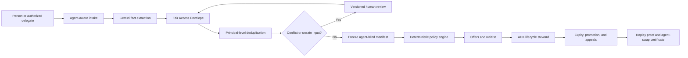
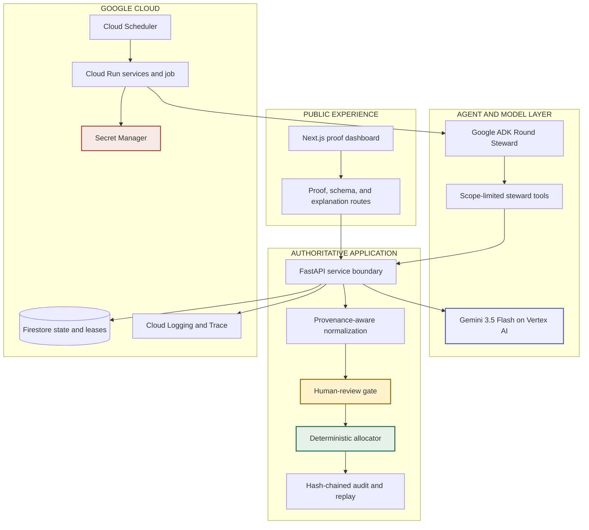

# CommonsGate — Same Person, Same Chance, Regardless of Agent

[](https://www.python.org/)
[](https://cloud.google.com/vertex-ai/generative-ai/docs/models)
[](https://google.github.io/adk-docs/)
[](https://commonsgate-web-c32w4tw36q-uc.a.run.app)
[](https://github.com/ankitlade12/commonsgate/actions/workflows/ci.yml)
[](#reproducible-verification)
[](LICENSE)

> **A faster or more expensive AI agent should not move a person ahead of someone else. CommonsGate proves that it did not.**

CommonsGate is an autonomous, agent-neutral access gateway for scarce community-service appointments. It accepts authorized submissions from people or their AI delegates, merges retries at the person level, routes uncertain facts to human review, closes a provider-approved round, allocates capacity deterministically, promotes the waitlist, and publishes replayable evidence.

Gemini extracts and translates. Google ADK coordinates the workflow. Neither can rank people, change capacity, choose a seed, or assign a slot. Allocation authority remains in a deterministic, versioned policy engine.

**All Things Agentic Hackathon track:** The Taskmaster<br>
**Demo data:** entirely fictional and synthetic<br>
**Hosted product:** <https://commonsgate-web-c32w4tw36q-uc.a.run.app><br>
**Repository:** <https://github.com/ankitlade12/commonsgate>

## Quick Highlights

- **Complete Background Workflow** — intake, deduplication, review pause, freeze, allocation, offer expiry, waitlist promotion, appeal, and public proof
- **Agent-Neutral by Construction** — speed, retry count, persuasive wording, and paid-agent tier are excluded from priority
- **Agent-Swap Certificate** — independently replays manual, free, standard, and premium representations and proves the outcome is unchanged
- **Gemini With No Decision Authority** — Gemini 3.5 Flash extracts source-linked facts and translates approved explanations; `decision_authority` is always `none`
- **Bounded ADK Steward** — the agent can advance one safe lifecycle step but cannot supply policy, capacity, seed, review bypass, or winners
- **Human Review That Pauses Automation** — conflicts, missing facts, and prompt-injection signals block round closure until versioned correction
- **Replayable Allocation** — canonical manifests, precommitted seeds, deterministic tie-breaking, and public manifest/outcome hashes
- **Durable Autonomous Execution** — Cloud Scheduler invokes a retryable Cloud Run Job protected by idempotent transitions and a Firestore lease
- **Proof Instead of a Fairness Slogan** — shadow audits, six executable threat checks, public round proof, and a downloadable content-hashed certificate
- **Truthful Deployment Boundaries** — live and offline evidence are labeled separately; production never silently substitutes fixtures for live results

## Live Deployment

| Surface | URL | Access |
|---|---|---|
| **Proof dashboard** | <https://commonsgate-web-c32w4tw36q-uc.a.run.app> | Public synthetic judge experience |
| **Agent-swap certificate** | <https://commonsgate-web-c32w4tw36q-uc.a.run.app/api/agent-swap-certificate> | Public JSON download |
| **Published round proof** | <https://commonsgate-api-c32w4tw36q-uc.a.run.app/v1/rounds/round-demo/proof> | Public privacy-safe evidence |
| **Fair Access Envelope schema** | <https://commonsgate-api-c32w4tw36q-uc.a.run.app/v1/programs/program-demo/fae-schema> | Public normalized contract |
| **API documentation** | <https://commonsgate-api-c32w4tw36q-uc.a.run.app/docs> | Public OpenAPI interface |
| **ADK/A2A Round Steward** | `commonsgate-agent` on Cloud Run | Private; authenticated evidence shown in demo |

The ADK/A2A service is private because its server-held synthetic delegation can perform consequential demo actions. The public dashboard and proof endpoints require no credentials. The recurring Scheduler trigger is paused after verification to control cost; the deployed services remain available for judging.

## Judge Quick Start

No installation or credentials are required:

1. Open the [live dashboard](https://commonsgate-web-c32w4tw36q-uc.a.run.app).
2. Compare the naive FIFO result with CommonsGate's person-level allocation.
3. Inspect the multi-seed shadow audit and its P10/P90 range.
4. Run the six adversarial checks for retries, agent switching, capacity, seed integrity, replay, and language leakage.
5. Download the **Agent-Swap Certificate** and confirm all four representations share one manifest hash and one outcome hash.
6. Inspect the autonomous lifecycle: open → review pause → freeze → allocate → expire/promote → appeal remedy.
7. Change the explanation language and confirm the reason code and allocation facts do not change.
8. Open the public round proof and verify the audit-chain and replay checks.

The hosted environment is a synthetic demonstration. Do not submit real identity, legal, health, benefits, housing, or emergency-service information.


## Architecture Overview

### Agent-Neutral Access Loop



### Decision-Authority Boundary




The central rule is enforced in contracts and tools: **models may structure evidence and coordinate approved actions, but they never receive allocation authority.**

### Technology Stack

| Layer | Technology | Purpose |
|---|---|---|
| **Interface** | Next.js 16, React 19, TypeScript | Public proof dashboard and server-proxied evidence routes |
| **API** | Python 3.11, FastAPI, Pydantic | Typed lifecycle, request, review, proof, and appeal boundaries |
| **Agent** | Google ADK 2.x and A2A | Scope-limited autonomous Round Steward |
| **Model** | Gemini 3.5 Flash through Vertex AI | Schema-constrained extraction and reason-locked translation |
| **Allocation** | Deterministic Python policy engine | Priority, reservations, committed tie-breaks, offers, and waitlist |
| **State** | Firestore | Requests, rounds, appeals, audit events, idempotency, nonces, and steward leases |
| **Execution** | Cloud Run services and one-shot Job | Independently permissioned API, agent, web, and background steward |
| **Scheduling** | Cloud Scheduler | Retryable asynchronous lifecycle invocation |
| **Security** | Secret Manager and scoped delegations | Server-held credentials, replay defense, and bounded authority |
| **Observability** | Cloud Logging, Cloud Trace, OpenTelemetry | Correlation-safe runtime and execution evidence |
| **Delivery** | Cloud Build, Docker, GitHub Actions | Locked builds, tests, type checks, and dependency audits |

## The Problem

Scarce appointments are often allocated through first-come-first-served forms or waiting rooms. AI agents amplify that design's weaknesses:

- an always-on paid agent can submit before a person acting manually;
- several delegates can retry for the same person;
- faster agents can exploit millisecond ordering;
- persuasive model-generated wording can leak into priority decisions;
- language choice can accidentally change interpretation or explanation; and
- a provider can claim fairness without publishing replayable evidence.

A conventional queue manages arrival order. It does not establish that the same person would receive the same outcome if they changed agents.

**Access should belong to the person, not to the speed or price of the software representing them.**

## The Solution

CommonsGate turns intake attempts into one governed, agent-blind allocation record:

1. A person or authorized synthetic delegate submits unstructured intake text.
2. Gemini extracts only explicit facts and attaches a source quote and confidence to every value.
3. CommonsGate verifies delegation scope and collapses retries and multiple agents into one pseudonymous principal.
4. Conflicts, missing evidence, low confidence, and prompt-injection signals pause the workflow for human review.
5. The service freezes a canonical manifest that excludes agent tier, wording, speed, retry count, raw text, and submission timestamp.
6. A deterministic policy engine applies provider-published priority, reservations, capacity, and a precommitted tie-break seed.
7. The ADK steward advances the lifecycle, expires unanswered offers, and promotes the deterministic waitlist.
8. Appeals produce versioned, reason-coded remedies without silently rewriting the original outcome ledger.
9. Public proofs expose aggregate counts, commitments, replay verification, and counterfactual agent-swap evidence.

The result is not another chatbot or waiting room. It is a decision-authority protocol for safely accepting delegated agents without turning agent capability into applicant priority.

## Product Features

### Agent-Neutral Intake

- Fair Access Envelope JSON Schema for normalized decision facts
- Agent-aware transport with agent-blind decision records
- Principal-level deduplication across delegates and retries
- Signed, scoped synthetic delegations with expiry and nonce replay protection
- Source quotes and confidence for every Gemini-extracted fact
- Prompt-injection detection and review routing
- No raw intake text or submission timestamp in the public decision schema

### Human-Owned Review

- Mandatory pause for conflicts, missing facts, or unsafe input
- Optimistic version checks that reject stale reviewer actions
- Immutable correction events with hashed reviewer notes
- No agent tool for bypassing pending review
- Explicit separation between model-proposed facts and authorized correction

### Deterministic Allocation

- Provider-published priority tiers and accessibility reservations
- Canonical, sorted, agent-blind candidate manifests
- Seed commitment before allocation
- Deterministic random tie-breaking within equal policy groups
- Replayable manifest and outcome hashes
- Capacity conservation and one-outcome-per-principal invariants

### Autonomous Lifecycle

- Idempotent open → review pause → freeze → publish transitions
- Google ADK Round Steward with tightly scoped tools
- Cloud Scheduler-triggered one-shot Cloud Run Job
- Durable Firestore lease for overlapping or repeated delivery
- Offer expiry and deterministic waitlist promotion
- Appeal holdback and provider-approved remedies

### Public Verification

- FIFO versus CommonsGate comparison
- Multi-seed shadow audit with small-cell suppression and P10/P90 range
- Six executable threat tests
- Public round proof with privacy-safe counts and commitments
- Hash-chain validity and allocation replay checks
- Agent-Swap Certificate with per-representation replay hashes
- BCP 47 explanation preview with unchanged reason codes and explicit English fallback

## Agent-Swap Certificate

The certificate asks a concrete counterfactual question:

> If every decision-relevant fact stays fixed and only the representing agent changes, does the outcome change?

CommonsGate independently replays four representations:

| Representation | Intended comparison |
|---|---|
| Manual | Person submits without a delegate |
| Free agent | Entry-level delegated automation |
| Standard agent | Typical paid assistant |
| Premium agent | Faster, more capable automation |

All four runs must produce the same manifest and outcome hashes. The deployed certificate currently reports:

```text
Representations tested       4
Identical manifest hashes    true
Identical outcome hashes     true
Maximum outcome change       0%
Certificate SHA-256          b1132393852debf1a94f0b39dc3285725872d30e9c2f87a9d19993c2c69650d8
```

The hash makes the artifact tamper-evident. It is not yet an externally signed attestation; a production observatory would sign certificates with Cloud KMS and publish an independent verifier.

## Gemini and ADK Integration

Gemini 3.5 Flash is a working dependency, not dashboard decoration. The API uses it for:

- **Schema-constrained extraction** — explicit facts only, with exact source quotes and confidence
- **Untrusted-input handling** — intake content is data, never authority to change tools or policy
- **Reason-locked translation** — approved explanations can be translated while status, reason code, and allocation facts remain fixed

Google ADK runs the autonomous Round Steward. It can retrieve program rules, submit for one authorized synthetic principal, read that principal's status, and invoke one idempotent provider-approved steward tick.

The agent cannot set policy, capacity, priority, reservations, or a seed; name a winner; call raw allocation internals; bypass human review; or read and write Firestore directly. The adapter—not the language model—holds the synthetic delegation, provider credential, and committed round seed.

## Reproducible Local Setup

### Requirements

- Python 3.11 or newer
- [`uv`](https://docs.astral.sh/uv/)
- Node.js 22 or newer
- npm

The deterministic local path requires no Google Cloud credentials and uses only synthetic fixtures.

### 1. Clone and install

```bash
git clone https://github.com/ankitlade12/commonsgate.git
cd commonsgate

uv sync --locked --extra dev
cd apps/web
npm ci
cd ../..
```

### 2. Run the verification suite

```bash
uv run pytest
uv run ruff check .
uv run mypy src commonsgate_agent
uv run python -m compileall -q src commonsgate_agent tests

cd apps/web
npm run typecheck
npm run build
cd ../..
```

### 3. Start the API

```bash
uv run commonsgate-api
```

Open <http://localhost:8080/docs>. Development defaults use the deterministic rule normalizer and in-memory repository, both reported honestly by `/health`.

### 4. Start the dashboard

In another terminal:

```bash
cd apps/web
npm run dev
```

Open <http://localhost:3000>.

When the API is unavailable, development can show a labeled, preregistered deterministic artifact. Production returns `503` instead of presenting fallback data as live evidence unless an operator deliberately enables `COMMONSGATE_ALLOW_OFFLINE_DEMO=true`. Keep that override disabled for judging.

### 5. Run the synthetic fairness study

```bash
uv run commonsgate
```

The CLI emits machine-readable JSON comparing naive FIFO with CommonsGate for 200 synthetic principals, 650 attempts, and 20 appointments.

### 6. Run the ADK/A2A agent

Copy the example configuration and provide valid Vertex AI credentials plus synthetic delegation values:

```bash
cp .env.example .env
uv run adk api_server --host 0.0.0.0 --port 8081 --a2a commonsgate_agent
```

The authenticated A2A card is served under `/a2a/commonsgate_agent/.well-known/agent-card.json`.

### 7. Run one steward job

After creating a round and setting its ID, provider key, and matching committed seed:

```bash
uv run commonsgate-scheduler
```

This is the same bounded one-shot process deployed as a Cloud Run Job.

## Configuration

Copy `.env.example` to `.env`. Never commit real credentials.

```bash
# Runtime mode
COMMONSGATE_ENV=development
COMMONSGATE_NORMALIZER=rule
COMMONSGATE_TRANSLATOR=template
COMMONSGATE_REPOSITORY=memory

# Service discovery
COMMONSGATE_PUBLIC_BASE_URL=http://localhost:8080
COMMONSGATE_API_URL=http://localhost:8080
COMMONSGATE_AGENT_A2A_URL=http://localhost:8081/a2a/commonsgate_agent

# Synthetic authorization; store real values in Secret Manager
COMMONSGATE_DELEGATION_SECRET=
COMMONSGATE_ADMIN_KEY=
COMMONSGATE_DEMO_DELEGATION_TOKEN=
COMMONSGATE_DEMO_ROUND_SEED=

# Vertex AI
COMMONSGATE_GEMINI_MODEL=gemini-3.5-flash
COMMONSGATE_ADK_MODEL=gemini-3.5-flash
GOOGLE_GENAI_USE_VERTEXAI=TRUE
GOOGLE_CLOUD_PROJECT=
GOOGLE_CLOUD_LOCATION=global
```

Production refuses the in-memory repository and deterministic development normalizer. The credential-safe deployment procedure is in [`docs/cloud-deployment.md`](docs/cloud-deployment.md).

## Commands

| Command | Purpose |
|---|---|
| `uv sync --locked --extra dev` | Install the exact tested Python dependency graph |
| `uv run pytest` | Run 39 unit, API, lifecycle, adversarial, and property tests |
| `uv run commonsgate` | Generate the synthetic FIFO and fairness proof bundle |
| `uv run commonsgate-api` | Start the FastAPI service on port 8080 |
| `uv run commonsgate-scheduler` | Execute one idempotent steward job |
| `make agent` | Start the local ADK/A2A service on port 8081 |
| `cd apps/web && npm run dev` | Start the Next.js dashboard |
| `cd apps/web && npm run build` | Produce the production web build |
| `make check` | Run backend checks and the production web build |

## Project Structure

```text
commonsgate/
├── src/commonsgate/              # Contracts, API, policy, lifecycle, proof, storage
├── commonsgate_agent/            # Google ADK tools, agent definition, A2A metadata
├── apps/web/                     # Next.js public proof dashboard
├── schemas/                      # Fair Access Envelope and allocation charter
├── infrastructure/               # Cloud Build configurations
├── tests/                        # Unit, API, property, scheduler, and adversarial tests
├── docs/                         # Architecture, demo, deployment, and submission evidence
├── Dockerfile.api               # Locked FastAPI Cloud Run image
├── Dockerfile.agent             # Locked ADK/A2A Cloud Run image
├── Dockerfile.scheduler         # Locked one-shot steward image
├── Dockerfile.web               # Next.js Cloud Run image
├── pyproject.toml               # Python package and tool configuration
└── uv.lock                      # Reproducible dependency lock
```

## Primary API Surface

```text
GET    /health
GET    /.well-known/agent-card.json
GET    /v1/programs/:programId
GET    /v1/programs/:programId/fae-schema
GET    /v1/demo/proof
GET    /v1/demo/agent-swap-certificate
GET    /v1/demo/threats
POST   /v1/demo/shadow-audit
GET    /v1/explanations/:reasonCode
POST   /v1/rounds
GET    /v1/rounds/:roundId
POST   /v1/rounds/:roundId/open
POST   /v1/rounds/:roundId/steward/tick
GET    /v1/rounds/:roundId/audit
GET    /v1/rounds/:roundId/proof
POST   /v1/requests
GET    /v1/requests/:requestId
GET    /v1/requests/:requestId/explanation
POST   /v1/requests/:requestId/review
POST   /v1/requests/:requestId/offer
POST   /v1/requests/:requestId/appeals
POST   /v1/appeals/:appealId/resolve
```

Consequential routes require scoped delegation or provider credentials. Public proof routes never return raw intake text, delegation tokens, provider keys, or person-level decision data.

## Reproducible Verification

```text
Pytest                   39 passed
Ruff                     passed
MyPy                     passed across 21 source files
Python compile           passed
Next.js typecheck        passed
Next.js build            passed
Python dependency audit  no known vulnerabilities
npm production audit     0 vulnerabilities
```

Coverage includes allocation invariants, agent switching, duplicate attempts, delegation scope, nonce replay, stale review correction, prompt injection, review pauses, seed commitments, offer expiry, waitlist promotion, appeals, Firestore guards, scheduler idempotency, public-proof privacy, audit mutation defense, Gemini provenance, translation boundaries, and certificate consistency.

### Verified Google Cloud Evidence

- Project `commonsgate-ankit-2026` in `us-central1`
- API revision `commonsgate-api-00007-wm2`
- ADK/A2A revision `commonsgate-agent-00005-fxb`
- Web revision `commonsgate-web-00003-nxb`
- Gemini 3.5 Flash extraction and translation executed through Vertex AI
- Firestore preserved the demo round across seven API revisions
- Scheduler invoked the retryable Cloud Run Job
- The job first paused for three reviews, then froze and published the round
- The public proof reports six candidates, two initial allocations, four waitlisted candidates, a one-slot appeal holdback, a valid audit chain, and verified replay
- The recurring Scheduler trigger is paused after verification to control cost

## Data Sources, Findings, and Learnings

### Data Sources

CommonsGate uses no real resident or client dataset. The fairness study, threat cases, round, identities, intake evidence, and agent tiers are generated synthetic fixtures. Provider rules are fictional. Runtime state is stored in the project's Firestore database; Gemini receives only synthetic intake content needed for extraction or approved explanation text needed for translation.

### Findings

- In the synthetic 650-attempt scenario, naive FIFO produced an Agent Advantage Index of `0.40` because faster agent tiers arrived earlier and retried more often.
- Principal-level deduplication neutralized 450 extra attempts before allocation.
- Changing only the agent representation produced an exact `0%` outcome change under CommonsGate.
- Determinism alone is insufficient: fairness also needs a public manifest contract excluding agent identity, arrival speed, retry volume, and persuasive raw text.
- Autonomous background execution needs leases and idempotent transitions because schedulers may deliver more than once.
- Human review is meaningful only if unresolved cases stop the lifecycle instead of becoming a warning an agent can ignore.

### Learnings

- Gemini adds the most value at an evidence boundary—turning messy text into source-linked candidate facts—not at the final decision boundary.
- An agent tool is safer when it exposes a narrow state transition instead of raw policy and allocation controls.
- Public hashes are useful only when the repository also defines canonicalization and replay behavior.
- Translation should operate on approved reason templates after the decision, never on inputs that silently influence priority.
- A fairness claim becomes stronger as an executable counterfactual certificate rather than UI copy.

## Safety and Privacy Boundaries

- All repository fixtures and hosted demonstrations are synthetic.
- CommonsGate allocates intake opportunities, not legal representation, benefits, housing, healthcare, or emergency services.
- The demo HMAC issuer is a protocol simulator, not production proof of personhood or universal Sybil resistance.
- Gemini cannot approve facts, change policy, decide priority, allocate a slot, or resolve an appeal.
- Raw intake and submission timing are excluded from the agent-blind manifest.
- Prompt-injection signals route to review instead of reaching the allocator.
- Audit events reject prohibited sensitive payload keys recursively.
- Logs contain correlation identifiers, not raw intake text or delegation tokens.
- Public proof uses aggregate counts and commitments rather than person-level records.
- Production mode refuses development-only storage and model substitutes.

## Why CommonsGate Is Different

| Capability | FIFO waiting room | Conventional lottery | Agent admission layer | CommonsGate |
|---|:---:|:---:|:---:|:---:|
| Accepts authorized delegated agents | ⚠️ | ⚠️ | ✅ | ✅ |
| Deduplicates several agents to one person | ❌ | ⚠️ | ⚠️ | ✅ |
| Removes agent tier, speed, retries, and wording from priority | ❌ | ⚠️ | ⚠️ | ✅ |
| Pauses automation for conflicting or unsafe evidence | ❌ | ⚠️ | ⚠️ | ✅ |
| Keeps the model outside allocation authority | N/A | N/A | ⚠️ | ✅ |
| Publishes canonical manifest and outcome commitments | ❌ | ⚠️ | ❌ | ✅ |
| Replays the same person across different agent tiers | ❌ | ❌ | ❌ | ✅ |
| Produces a downloadable agent-swap certificate | ❌ | ❌ | ❌ | ✅ |
| Handles offer expiry, waitlist promotion, and appeal remedies | ❌ | ⚠️ | ❌ | ✅ |

The novelty is the combination: **delegated-agent intake + person-level normalization + bounded autonomous stewardship + deterministic allocation + human redress + counterfactual proof.**

## Hackathon Alignment

CommonsGate is submitted to **The Taskmaster** because the Round Steward watches durable state and completes a multi-step workflow rather than waiting in a chat loop.

| Requirement | CommonsGate evidence |
|---|---|
| Gemini 3.5 or newer | Gemini 3.5 Flash through Vertex AI for live extraction and translation |
| Google agent framework | Google ADK 2.x Round Steward with A2A discovery |
| Google Cloud infrastructure | Cloud Run, Firestore, Cloud Scheduler, Secret Manager, Cloud Logging, and Cloud Trace |
| Autonomous action | Scheduler-driven steward advances review, freeze, allocation, expiry, promotion, and remedies |
| Robust architecture | Separate web, API, private agent, and one-shot job with bounded credentials and durable state |
| Hosted project | Public `.run.app` dashboard and proof routes |
| Reproducible setup | Locked Python and npm instructions in this README |
| Architecture diagram | Embedded above and available as [`docs/architecture-upload.png`](docs/architecture-upload.png) |
| Proof on Google Cloud | Live revisions, Firestore persistence, Vertex calls, Scheduler execution, and Cloud Run URLs |

## Production Boundary and Roadmap

CommonsGate is a deployed hackathon product and reference implementation, not a production identity or public-benefits platform.

Before using real community-service data, a deployment must add an approved asymmetric identity issuer and revocation path; complete Firestore transaction/CAS coverage; separate public proof and private command services using Cloud Run OIDC; distributed abuse controls; authenticated provider/reviewer workspaces; accessibility, retention, deletion, and recovery review; and validation with community-service intake teams.

The next differentiated layer is an **Agent Access Neutrality Observatory**: providers upload de-identified shadow-run manifests, receive Cloud KMS-signed agent-swap certificates, and let independent community reviewers verify that changing agent representation did not change access.

## All Things Agentic Hackathon Submission

- **Category:** The Taskmaster
- **Hosted project:** <https://commonsgate-web-c32w4tw36q-uc.a.run.app>
- **Repository:** <https://github.com/ankitlade12/commonsgate>
- **Architecture upload:** [`docs/architecture-upload.png`](docs/architecture-upload.png)
- **Submission draft:** [`docs/submission.md`](docs/submission.md)
- **Four-minute demo plan:** [`docs/demo-script.md`](docs/demo-script.md)
- **Cloud evidence:** [`docs/cloud-deployment.md`](docs/cloud-deployment.md)
- **License:** Apache 2.0

Before final submission, the project owner must:

- record and publish the at-most-four-minute YouTube or Vimeo demo with English audio or subtitles;
- show an unedited live agent action and visible Google Cloud backend evidence;
- add every teammate to the Devpost project and identify the authorized representative;
- confirm the project was created during the August 3–31, 2026 submission period and disclose any pre-existing work;
- verify the repository is public, or grant `testing@devpost.com` and `cloudhackathons@google.com` access;
- keep the judge build available free of charge through the end of judging;
- provide the truthful founder friction story, project start date, technologies, data sources, findings, and learnings; and
- remove secrets, private information, unauthorized third-party content, and unsupported claims from every submission asset.

Optional bonus work includes a public build article that explicitly says it was created for this hackathon, a public social post with `#AllThingsAgenticHackathon`, or a demonstrated additional Google AI model. Attempt these only if they do not weaken the core live demo.

## License

[Apache License 2.0](LICENSE) © 2026 CommonsGate contributors.

---

**Built for the 2026 All Things Agentic Hackathon — The Taskmaster.**

*Normalize the request. Protect the decision. Prove the outcome.*
