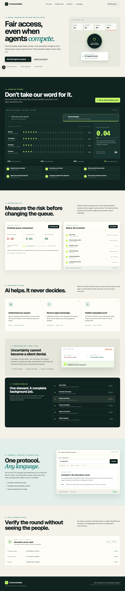
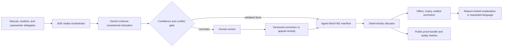

# CommonsGate

CommonsGate is a fair-access protocol for scarce community-service appointments.
It accepts authorized agent submissions while preventing agent speed, retry volume,
or multiple agents from becoming applicant priority.

The safety boundary is intentional: Gemini extracts explicitly stated facts and
ADK orchestrates the full round lifecycle. A deterministic, versioned policy
engine performs allocation. A model never ranks people or assigns slots.

## What works now

- Agent-blind canonical candidate manifests
- Principal-level deduplication across retries and delegate agents
- Human-review routing for conflicting duplicate facts
- Priority tiers and accessibility capacity reservations
- Committed, deterministic random tie-breaking
- Replayable manifest and outcome hashes
- FIFO baseline and synthetic agent-tier fairness comparison
- Exact counterfactual test: changing only the representing agent leaves the
  CommonsGate outcome unchanged
- Versioned JSON Schemas for the Fair Access Envelope and allocation charter
- Signed, scoped synthetic delegation tokens and nonce replay protection
- Transport idempotency and cross-agent principal deduplication
- Provenance and confidence validation with prompt-injection review routing
- Hash-chained audit events that reject raw sensitive payload fields
- Typed FastAPI request, status, round, allocation, audit, and discovery routes
- Google ADK 2.x Round Steward with a server-held, scope-limited workflow tool
- Idempotent open → review pause → freeze → publish steward transitions
- Expiring offers and deterministic waitlist promotion
- Versioned appeals with provider-approved holdback and next-round remedies
- Multi-seed shadow audit with small-cell suppression and a signed report hash
- Executable adversarial report for retry, agent-switch, capacity, seed, replay,
  and language-leak controls
- Firestore production repository and in-memory test adapter
- Cloud Run containers for independently permissioned API and agent services
- Public privacy-safe proof bundles with aggregate counts, commitments, and replay verification
- Immutable human-review corrections with optimistic version checks and hashed reviewer notes
- BCP 47 response-language support with Gemini translation of reason-locked copy and explicit fallback reporting
- A production-built Next.js proof dashboard with an interactive FIFO comparison,
  shadow audit, attack lab, autonomous workflow, reviewer trace, language preview,
  and public hashes



## Install and verify

Python 3.11 or newer and `uv` are required.

```bash
uv sync --extra dev
uv run pytest
uv run commonsgate
```

The CLI produces machine-readable JSON comparing a naive FIFO queue with
CommonsGate for 200 synthetic principals competing for 20 appointments.

The current test suite includes unit, API integration, adversarial, and
property-based invariant tests.

## Run the product dashboard

In a second terminal:

```bash
cd apps/web
npm install
npm run dev
```

Open `http://localhost:3000`. The dashboard uses the live API when available and
falls back to the same pre-registered deterministic demonstration artifact when
the API is offline. Set `COMMONSGATE_TRANSLATOR=gemini` on the API to translate
approved reason-code explanations on demand for any BCP 47 language tag supported
by the configured model. Translation never changes status, reason code, or
allocation facts; failures visibly deliver the approved English template instead.

## Run the local API

```bash
uv run commonsgate-api
```

Open `http://localhost:8080/docs` for the API contract. Development defaults use
the deterministic rule normalizer and in-memory storage so no credentials are
required. They are visibly reported by `/healthz` and cannot be used when
`COMMONSGATE_ENV=production`.

## Run the Google ADK agent

Configure Gemini or Vertex AI credentials and the synthetic delegation variables
described in `.env.example`, start the API, then run:

```bash
uv run adk api_server --host 0.0.0.0 --port 8081 --a2a commonsgate_agent
```

The agent can retrieve program rules, submit one authorized synthetic request,
read that principal's status, and invoke an idempotent provider-approved steward
tick. The adapter—not the model—holds the admin credential and committed seed.
The tool cannot name a winner, change capacity or policy, choose a seed, or bypass
a pending human review.

## Current architecture boundary



See [the product and engineering assessment](docs/product-strategy.md) and the
full [PRD](hh.md). The security boundaries and deployment topology are documented
in [architecture](docs/architecture.md), and the credential-safe deployment
sequence is in [the Cloud runbook](docs/cloud-deployment.md).
The remaining work is explicitly prioritized in
[the submission readiness checklist](docs/remaining-work.md).

## Current verification boundary

The API, deterministic fallback, proof and threat endpoints, shadow audit,
review/appeal/remedy flow, offer promotion, dashboard, Firestore adapter
construction, and ADK application definition are implemented. Local automated
checks are verified. Live Gemini
extraction/translation, ADK inference, Firestore operations, and Google Cloud
deployment still require project authentication and are not claimed as verified.

## Data and safety

Only synthetic people and evidence are permitted in the hackathon build. This
prototype allocates intake opportunities, not legal representation, benefits,
housing, healthcare, or emergency services.
