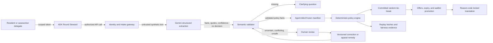

# Architecture and trust boundaries

## Decision authority

Gemini can transform representation, but only conventional code can change an
authoritative request or round state. The allocator receives neither raw text nor
agent metadata.

The translation adapter receives only an approved reason-code template and a BCP
47 target tag. It receives no evidence or identity, has `decision_authority=none`,
and cannot change the authoritative reason code. The response records both the
requested and delivered language; model failure produces an explicit English
fallback rather than silent or fabricated translation.

## Two manifests

- **Intake audit record:** request ID, agent ID, timing, retry and deduplication
  events, content hash, correlation ID, and model version. It is operationally
  sensitive and is never used for candidate ranking.
- **Allocation manifest:** program-scoped principal token, deterministic priority
  tier, service-area eligibility, and binary accommodation reservation fact. Its
  hash is independent of agent vendor, model, latency, verbosity, and retries.

This split prevents agent behavior from leaking back into deterministic seed
derivation.

## Identity boundary

The MVP signs short-lived delegation claims with HMAC for synthetic demonstrations.
Claims bind the agent, principal token, provider, program, scopes, issue time, and
expiry. Every mutation also requires a single-use nonce and an idempotency key.

Production must replace the synthetic issuer with Agent Identity or another
approved issuer. CommonsGate consumes a scoped principal token; it does not prove
that the token maps to exactly one real-world human and does not claim universal
Sybil resistance.

## Storage boundary

- Firestore is authoritative for rounds, normalized facts, statuses, and outcome
  artifacts.
- Secret Manager holds signing, administrative, and demo delegation secrets.
- Raw evidence belongs in a separate restricted object store; the current API
  stores only a content hash and opaque reference.
- The allocator receives an in-memory projection of policy facts only.
- Audit events are hash-chained and reject known raw-PII keys.
- Idempotency receipts, consumed nonces, the audit-chain head, and steward leases
  are durable Firestore records. A transaction serializes audit appends and a
  time-bounded lease prevents duplicate scheduler delivery from advancing the
  same round concurrently.
- Public metrics must be aggregate and apply small-cell suppression.

Agent Platform sessions or Memory Bank may retain interaction preferences, but
must not become the authoritative source of policy facts or allocations.

## State and replay

1. A provider commits to a secret random seed before intake closes.
2. Authorized requests enter an open round.
3. Missing facts stay out of the candidate set; uncertainty and injection signals
   enter human review.
4. Close freezes qualified request IDs and the agent-blind manifest hash.
5. Allocation requires a seed whose commitment matches the precommitted value.
6. The published result stores the revealed seed plus manifest and outcome hashes.
7. Replaying the same charter, manifest, inventory, and seed yields the same result.
8. A public proof projection exposes aggregate counts and commitments but omits
   principal, request, and agent identifiers.
9. The steward expires unanswered offers and promotes the next request in the
   original deterministic waitlist order.
10. Appeal decisions append to a separate remedy hash ledger so the original
    allocation replay remains immutable.
11. Cloud Scheduler invokes a one-shot Cloud Run Job. Each job calls the steward
    with the preconfigured round and server-held seed, emits only aggregate
    transition metadata, and exits. Cloud Run retries failures; duplicate calls
    become lease conflicts or idempotent no-ops.

## Current implementation versus production target

| Concern | Local/test adapter | Deployment adapter |
|---|---|---|
| Normalization | Deterministic rule fallback | Gemini structured extraction |
| Explanation | Approved English template with explicit fallback | Gemini translation of approved copy for requested BCP 47 tag |
| State | In-memory repository | Firestore repository |
| Delegation issuer | Synthetic HMAC issuer | Agent Identity or approved identity issuer |
| Agent sessions | In memory | Agent Platform Sessions or managed equivalent |
| Secrets | Environment placeholders | Secret Manager references |
| Audit | In-process hash chain | Durable audit documents plus Cloud Logging/Trace |
| Background execution | Manual one-shot command | Cloud Scheduler → Cloud Run Job |
| Serving | FastAPI and ADK CLI | Separate Cloud Run API, web, and ADK services |

Production mode refuses to start with the rule normalizer, in-memory repository,
or development secrets.
