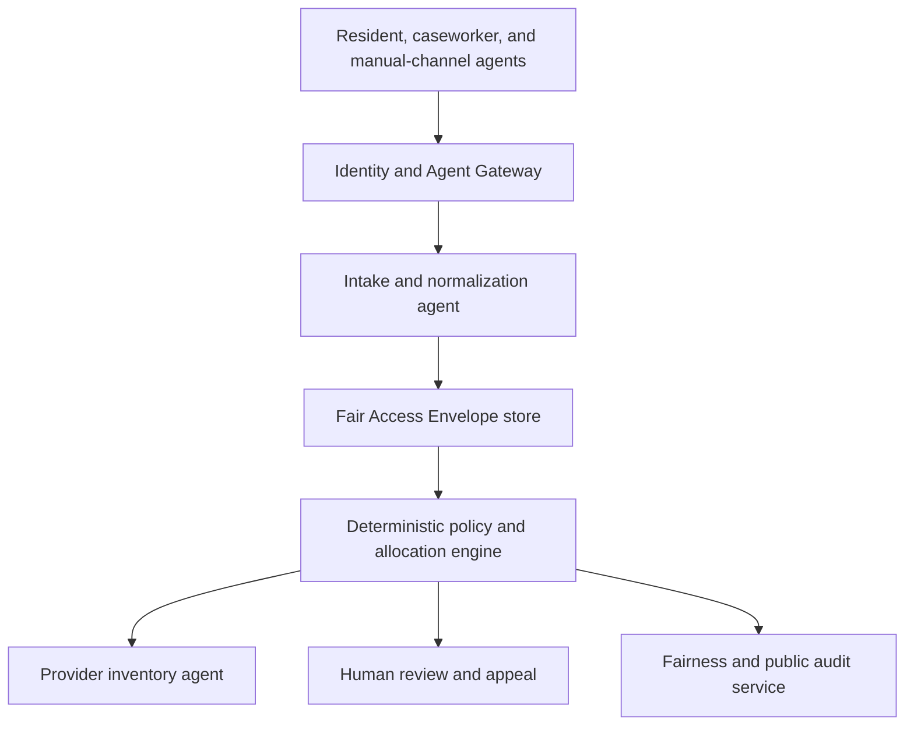
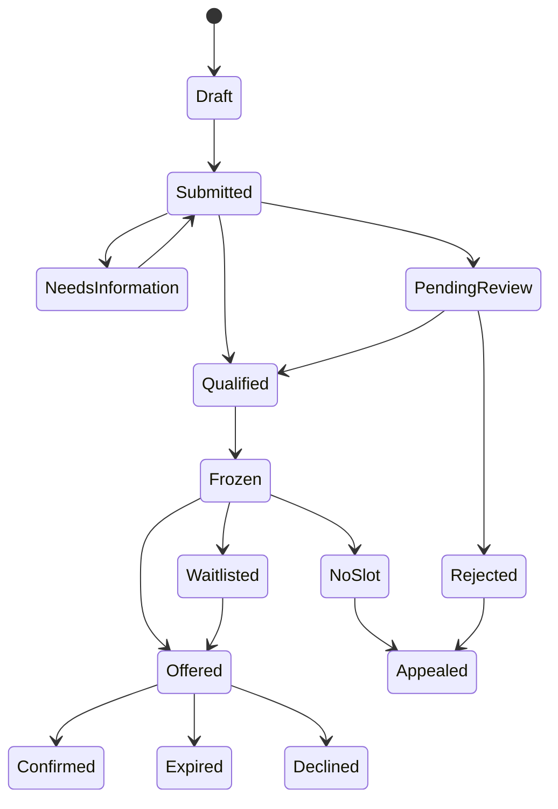
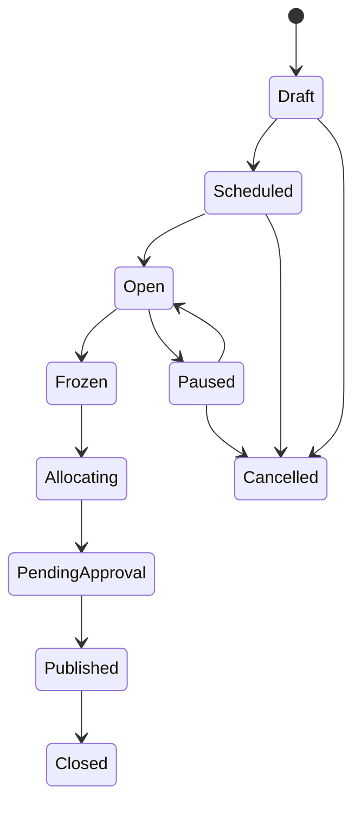

# CommonsGate

## Product Requirements Document

**Working title:** CommonsGate  
**One-line description:** A fair-access protocol that prevents powerful AI agents from monopolizing scarce community-service appointments.  
**Hackathon:** All Things Agentic Hackathon 2026  
**Recommended track:** Taskmaster  
**Document status:** Implementation-aligned MVP  
**Version:** 1.1  
**Date:** August 22, 2026  
**Product owner:** Ankit Hemant Lade  

---

## 1. Executive summary

As personal AI agents become capable of finding, applying for, and booking services, they create an unintended access problem. People with faster models, paid agents, persistent automation, multiple agents, or better technical infrastructure may capture scarce appointments before people using slower agents or manual interfaces can respond. Existing bot defenses try to block automation, existing queues generally regulate arrival order, and existing agent gateways govern security. None of these categories is designed to ensure that two equally situated people receive the same opportunity regardless of the capability of the agent representing them.

CommonsGate is a neutral access layer between authorized personal agents and providers of scarce community resources. It converts requests from different agents into a standard **Fair Access Envelope**, associates multiple agents with one represented human, removes advantages created by speed and retry volume, applies a published community-defined allocation charter, uses deterministic rules and auditable randomization to allocate intake appointments, and provides explanations, human review, and appeals.

The hackathon MVP will model a nonprofit legal-aid clinic with 20 eviction-support intake appointments and 200 synthetic applicants. A baseline first-come-first-served system will visibly favor premium and high-frequency agents. CommonsGate will demonstrate that allocation outcomes remain substantially invariant to agent tier while continuing to respect legitimate urgency and accessibility rules.

The central product promise is:

> The same person with the same circumstances should receive the same opportunity regardless of which AI agent represents them.

CommonsGate will allocate **appointments and intake opportunities**, not make final determinations about legal representation, benefits, housing, healthcare, or other life-critical outcomes.

### 1.1 Implemented MVP snapshot

The repository now proves the core product through working, testable surfaces rather than mock screens:

| Capability | Implemented evidence |
|---|---|
| Agent-neutral allocation | Deterministic allocator, principal deduplication, priority/reservation policy, committed tie-break, property tests |
| Quantified differentiation | 200-person/20-slot scenario: FIFO AAI `0.40`, CommonsGate AAI `0.04`; manual-to-premium individual outcome sensitivity `90%` versus `0%` |
| Public verification | Synthetic and published-round proof APIs with aggregate counts, six invariants, manifest hash, seed commitment/reveal, outcome hash, and replay result |
| Safe AI boundary | Google ADK Round Steward, Gemini schema-constrained normalizer, provenance validation, prompt-injection review routing |
| Human correction | Authorized reviewer correction with immutable normalization history, optimistic request versions, deterministic reevaluation, and hashed notes |
| Language-neutral access | Any syntactically valid BCP 47 response tag; reason-code locked Gemini translation; requested/delivered language and fallback status reported; language excluded from policy facts |
| Complete workflow | Idempotent steward opens intake, pauses for review, freezes, publishes, expires offers, promotes the waitlist, and records appeal remedies |
| Buyer proof | Multi-seed shadow audit, small-cell suppression, executable threat report, and signed report hashes |
| Usable experience | Responsive Next.js proof dashboard with FIFO comparison, shadow audit, threat lab, steward timeline, review trace, language preview, and public cryptographic artifact |

The local backend suite, Python lint/type checks, Next.js strict typecheck and production build, and browser interaction checks pass. Live Gemini, ADK, Firestore, observability, and Cloud Run evidence remain deployment gates and must not be claimed until credentials are configured and the recorded flow succeeds.

---

## 2. Decision summary

| Decision | Selection | Rationale |
|---|---|---|
| Product | CommonsGate | Addresses a gap created specifically by agentic AI rather than adding an agent to an existing workflow |
| Primary community use case | Housing-related legal-aid intake appointments | Scarce, understandable, socially meaningful, and safer than automating final benefit allocation |
| Primary buyer/operator | Nonprofit clinic, community organization, or public-service provider | Controls appointment inventory and allocation policy |
| Primary beneficiary | Resident seeking assistance | Receives access independent of agent speed, cost, or persistence |
| Hackathon track | Taskmaster | The Round Steward completes a high-value asynchronous workflow while deterministic tools enforce consequential decisions |
| AI role | Interpret, normalize, detect ambiguity, assist policy authoring, and explain | Uses agentic capabilities without delegating final high-stakes ranking to a model |
| Allocation role | Deterministic policy engine plus auditable randomization | Reproducible and appealable |
| Demo data | Fully synthetic | Avoids exposing sensitive legal or personal information |
| MVP output | Appointment offer, waitlist result, review request, or rejection with reason and appeal path | Provides a complete and testable user outcome |
| Open-source contribution | Fair Access Envelope schema, allocation reference implementation, simulator, and evaluation metrics | Makes the community benefit portable beyond one application |

---

## 3. Product thesis

### 3.1 Problem statement

Scarce services are often allocated through first-come-first-served forms, appointment schedulers, waitlists, phone queues, or caseworker referrals. These mechanisms already disadvantage people with limited connectivity, limited time, disabilities, language barriers, or low digital literacy. Agentic AI can reduce those barriers by completing tasks for people, but it can also intensify competition. A capable agent can monitor continuously, submit immediately, retry aggressively, coordinate across accounts, or discover unintended system behavior.

This produces **agent-mediated access inequality**: allocation outcomes vary because of the representing agent rather than the represented person's circumstances.

### 3.2 Product hypothesis

If a provider:

1. verifies delegated agent authority,
2. normalizes requests into a common representation,
3. limits each human to one active opportunity per allocation round,
4. removes speed and retry-volume advantages,
5. applies a published, deterministic allocation charter,
6. randomizes only among equivalently situated applicants, and
7. supports human review and appeal,

then the provider can accept legitimate agent traffic while preventing agent capability from becoming a new barrier to community services.

### 3.3 Why now

- Research has begun describing **agentic inequality**, where differential access to capable AI agents creates new disparities.
- AI agents increasingly perform bookings, applications, form filling, monitoring, and tool use.
- Existing anti-bot systems are built mainly to block or throttle automation, not accept authorized agents fairly.
- Agent interoperability and identity standards now make delegated agent access technically plausible.
- Community providers need a governance pattern before agent-driven demand becomes widespread.

### 3.4 Novelty claim

CommonsGate is not novel merely because it uses multiple agents. Its proposed novelty is the combination of:

- **Counterfactual agent invariance:** the represented person's probability of access should not materially change when the representing agent changes.
- **Fair Access Envelope:** a provider-neutral request format that removes model-specific persuasion, verbosity, retry behavior, and timing advantages.
- **Principal-level deduplication:** action budgets apply to the represented human, not merely to IP address, account, or agent identity.
- **Speed-normalized allocation rounds:** requests within a published window are considered together.
- **Agent Advantage Index:** an explicit measure of whether free, standard, and premium agents obtain different outcomes for otherwise equivalent people.
- **Community-defined allocation charter:** providers and affected communities define acceptable allocation rules instead of allowing an opaque model to infer them.

Public-market research found queue management, bot defense, agent-security gateways, referral platforms, and resource-allocation algorithms, but did not identify a public product centered on this complete invariant. This is a defensible hackathon novelty claim, not proof of global or patent-level uniqueness.

---

## 4. Evidence and market context

### 4.1 Evidence that the problem exists

- Oxford Martin School researchers describe disparities created by differential access to capable agents as **agentic inequality**: [Agentic Inequality](https://www.oxfordmartin.ox.ac.uk/publications/agentic-inequality).
- An August 2026 incident reportedly involved an agent exploiting a booking system, booking outside the intended window, and removing another person from a waitlist: [The Guardian](https://www.theguardian.com/technology/2026/aug/13/ai-agents-arent-legally-responsible-for-any-harm-that-they-cause-experts-say-so-who-is).
- Bots and resellers have distorted access to scarce driving-test appointments: [The Guardian investigation](https://www.theguardian.com/money/article/2024/jul/04/they-have-you-over-a-barrel-how-scammers-touts-and-bots-took-over-driving-tests).
- Cloudflare describes automated clients as unfair competitors because they can operate faster and more efficiently than humans: [Cloudflare Waiting Room](https://blog.cloudflare.com/banish-bots-from-your-waiting-room-and-improve-wait-times-for-real-users/).
- Research on scarce homeless-service allocation emphasizes explicit fairness assumptions and human override: [Journal of Artificial Intelligence Research](https://www.jair.org/index.php/jair/article/download/12847/26920/34085) and [University of Michigan policy brief](https://stpp.fordschool.umich.edu/research/policy-brief/algorithmic-prioritization-systems-homeless-services-must-have-human).
- Structured randomization can improve fairness in appropriate decision settings without necessarily degrading decision quality: [MIT](https://news.mit.edu/2024/study-structured-randomization-ai-can-improve-fairness-0724).

### 4.2 Existing categories and gaps

| Category | Representative examples | Existing capability | Remaining gap |
|---|---|---|---|
| Community referral networks | Findhelp, Unite Us, One Degree, 211 | Search, referrals, eligibility guidance, closed-loop coordination | No cross-agent fairness invariant for scarce slots |
| Virtual waiting rooms | Queue-it, Cloudflare | Traffic shaping, randomized pre-queue, FIFO, bot mitigation | Generally identity- and traffic-centric, not principal-level community allocation |
| Appointment and walk-in queues | Qminder, WaitWell, Qwaiting, Skiplino | Scheduling, waitlists, notifications, operations dashboards | Speed, timing, and repeated monitoring can remain advantageous |
| Bot and abuse protection | Arkose Labs, Akamai, Cloudflare | Risk scoring, challenge mechanisms, automation detection | Authorized personal agents are not necessarily malicious but can still create inequity |
| Agent gateways | Google, Ping Identity, enterprise gateway vendors | Identity, permissions, tool policies, routing, observability | Enterprise protection, not domain-specific fairness among human principals |
| Public-benefit policy engines | PolicyEngine, Benefit Kitchen, rules-as-code projects | Eligibility calculation, policy simulation, benefit rules | Not designed to normalize agent capability at the access boundary |
| Scarce-resource allocation research | Homeless services, healthcare, education | Matching and prioritization methods | Often focuses on recipient ranking, not agent-mediated intake behavior |

### 4.3 Products this must not become

- A general community-service chatbot
- A directory wrapper around 211 or Findhelp
- An AI eligibility determination engine
- A generic fraud detector
- A conventional virtual waiting room with an AI label
- A multi-agent demonstration with no measurable public benefit
- A black-box risk score for vulnerable applicants

---

## 5. Goals, non-goals, and principles

### 5.1 Product goals

1. Demonstrate that powerful agents can create unequal access in a conventional queue.
2. Reduce outcome dependence on agent model, cost, speed, and retry behavior.
3. Permit legitimate delegated agent use rather than banning all automation.
4. Preserve legitimate provider priorities such as urgent deadlines and accessibility accommodations.
5. Make every allocation reproducible, explainable, and appealable.
6. Give providers a human-readable way to define and version allocation policy.
7. Publish aggregate fairness evidence without exposing applicant identity.
8. Produce an open reference protocol reusable by legal aid, tax clinics, food distributions, disaster assistance, cooling centers, healthcare navigation, and other appointment-based services.
9. Fit the hackathon's agent-framework, Google Cloud, architecture, demo, and new-project requirements.

### 5.2 MVP non-goals

1. Determining final eligibility for public benefits.
2. Diagnosing medical conditions or assigning clinical priority.
3. Determining who receives shelter, housing, cash assistance, legal representation, or emergency intervention.
4. Replacing provider staff or community governance.
5. Creating a universal government identity system.
6. Solving identity fraud in production.
7. Integrating with live legal-aid or government systems during the hackathon.
8. Storing original identity documents.
9. Claiming legal compliance certification.
10. Claiming that a single fairness definition works for every community.

### 5.3 Design principles

- **Person before agent:** policies attach to the represented person, not the agent vendor.
- **No speed privilege:** millisecond differences within an intake window do not affect outcomes.
- **Deterministic core:** a language model never performs the final allocation.
- **Minimum necessary data:** collect only fields required by the published policy.
- **No hidden criteria:** every allocation criterion has a visible policy identifier and version.
- **Appeal is a feature:** contestability is part of the normal workflow.
- **Uncertainty escalates:** low-confidence extraction or conflicting evidence triggers review.
- **Access beyond AI:** manual, phone, and caseworker requests can enter the same envelope format.
- **Community authority:** providers and affected stakeholders approve the charter.
- **Measure, do not assert:** fairness claims require controlled evaluation.

---

## 6. Glossary

| Term | Definition |
|---|---|
| Principal | The human whose access request is being submitted |
| Delegate agent | An agent authorized to act for a principal |
| Provider | Organization offering the scarce appointment or intake opportunity |
| Resource | The appointment category being allocated |
| Allocation round | A defined intake interval in which eligible requests are considered together |
| Fair Access Envelope (FAE) | Canonical representation of a principal's request |
| Allocation charter | Versioned rules defining eligibility gates, urgency tiers, reservations, tie-breaking, and review behavior |
| Principal token | Privacy-preserving identifier used to deduplicate a person within an authorized scope |
| Agent tier | Experimental category representing different agent capability levels; not a production applicant attribute |
| Counterfactual agent invariance | Outcome stability when only the representing agent changes |
| Agent Advantage Index (AAI) | Difference between the highest and lowest allocation rates across agent tiers for otherwise equivalent cases |
| Provider agent | Agent that publishes resource inventory and receives allocation outcomes |
| Review agent | Agent that summarizes uncertain cases for a human reviewer without deciding them |
| Appeal | Structured request for reconsideration based on incorrect data, missing evidence, policy misapplication, or accommodation need |
| Reason code | Stable machine-readable explanation for an outcome |

---

## 7. Users and stakeholders

### 7.1 Primary persona: resident seeking help

**Example:** Maya, a tenant who has received an eviction notice and needs a free legal-aid intake appointment.

**Needs**

- Submit a request in a preferred language and accessible format.
- Use a free assistant, a family member's agent, a caseworker, a phone operator, or a manual form.
- Know that using a slower agent will not reduce the chance of an appointment.
- Understand what information was used.
- Correct mistakes and appeal an outcome.
- Avoid repeatedly sharing sensitive documents.

**Pain points**

- Appointment openings disappear quickly.
- Forms use legal language.
- Work, childcare, disability, connectivity, or language constraints limit availability.
- Multiple organizations request the same information.
- Existing systems provide little explanation when no appointment is available.

### 7.2 Delegate persona: community caseworker

**Example:** Luis supports ten residents across multiple services.

**Needs**

- Prove delegated authority for a particular task and time period.
- Submit on behalf of multiple clients without mixing identities.
- See request status and missing information.
- Receive consistent machine-readable responses.
- Avoid accidentally duplicating a resident's request.

### 7.3 Provider administrator

**Example:** Renee manages appointment capacity for a nonprofit housing clinic.

**Needs**

- Publish appointment inventory.
- Define the intake window and allocation charter.
- Simulate policy effects before activation.
- Review uncertain or contested cases.
- Pause an allocation round.
- Audit every state transition.
- Monitor whether one agent or principal is abusing the system.

### 7.4 Community policy steward

**Example:** A lived-experience advisory board member or community advocate.

**Needs**

- Read policy in plain language.
- Compare proposed policy outcomes using synthetic or consented historical data.
- Identify unintended disparities.
- Approve, reject, or request changes to a policy version.
- See aggregate outcomes without seeing applicant identities.

### 7.5 Human reviewer

**Needs**

- Review low-confidence extraction, conflicting claims, accommodation requests, and appeals.
- See source provenance and the exact policy version.
- Correct fields without altering the original submission.
- Record a structured decision and justification.

### 7.6 Platform and security operator

**Needs**

- Register trusted provider agents.
- Revoke compromised agents.
- Configure tool permissions and action budgets.
- Inspect security events without accessing unnecessary case content.
- Export audit evidence.

---

## 8. Jobs to be done

1. **When I need a scarce community-service appointment,** help my chosen representative submit correctly without my opportunity depending on its technical power.
2. **When I represent multiple clients,** let me submit authorized requests while preserving each client's separate identity and privacy.
3. **When demand exceeds supply,** help me apply a community-approved allocation process consistently rather than rewarding whoever refreshes fastest.
4. **When the system cannot confidently interpret a request,** send it to a human without silently disadvantaging the applicant.
5. **When someone challenges an outcome,** reproduce the exact inputs, policy, random seed commitment, and decision path.
6. **When we change policy,** show how the proposed version would affect access before it becomes active.
7. **When agents interact with our service,** verify their authority, constrain their actions, and retain a complete audit trail.

---

## 9. Use cases

### 9.1 MVP use case: housing legal-aid intake

The provider releases 20 intake appointments for applicants facing a housing issue. Two hundred synthetic applicants use manual forms, free agents, standard agents, premium agents, or caseworker agents. Requests submitted during a 60-second window are normalized and evaluated together.

The charter may include:

- Service-area eligibility
- Court date or response deadline within a defined period
- Accessibility reservation
- One active request per principal
- Random tie-break among cases in the same priority tier
- Human review for ambiguous or inconsistent evidence

### 9.2 Later use cases

- Tax-preparation appointments
- Utility-assistance intake appointments
- Disaster-recovery intake sessions
- Cooling-center transport reservations
- Food-distribution pickup windows
- Immigration-clinic consultations
- Workforce-development enrollment appointments
- Library technology-help appointments

### 9.3 Explicitly excluded high-risk use cases for MVP

- Emergency dispatch
- Organ transplantation
- Emergency-room triage
- Child-protection decisions
- Criminal-justice decisions
- Final immigration determinations
- Final benefit eligibility
- Permanent-housing allocation

---

## 10. End-to-end user journey

### 10.1 Provider setup

1. Provider administrator creates a resource program.
2. Administrator enters capacity, appointment dates, service boundaries, intake-window duration, response deadline, and cancellation behavior.
3. Policy steward drafts an allocation charter in plain language.
4. Gemini converts the draft into a proposed structured policy.
5. A deterministic validator checks schema, unsupported criteria, conflicts, and unsafe rules.
6. The policy simulator runs the proposal against synthetic cases.
7. Administrator and community steward inspect access rates, within-tier parity, reservation use, review volume, and no-slot reasons.
8. Two authorized humans approve the version.
9. System signs and activates the policy.
10. Provider agent publishes an Agent Card and resource inventory.

### 10.2 Request submission

1. A resident authorizes an agent for `submit_appointment_request` with a resource scope and expiration.
2. Agent discovers the provider through its Agent Card.
3. Agent requests the current intake schema and policy summary.
4. Agent submits a structured or natural-language request with evidence references.
5. Gateway validates agent identity, principal delegation, scope, expiration, nonce, and action budget.
6. System derives or receives a scoped principal token.
7. Intake agent checks for an existing active request.
8. Gemini extracts fields and returns values, provenance, and confidence for each field.
9. Deterministic validators enforce types, allowed values, date formats, and required evidence.
10. Missing information is requested once in a structured form.
11. High-confidence complete requests become `QUALIFIED_FOR_ROUND`.
12. Ambiguous, conflicting, or accommodation-sensitive requests become `PENDING_HUMAN_REVIEW`.
13. Applicant receives a receipt with request ID, policy version, deadline, and current state.

### 10.3 Allocation

1. Intake window closes.
2. System freezes the eligible request set and generates a manifest hash.
3. Policy engine applies hard eligibility gates.
4. Policy engine assigns published priority tiers.
5. Reservation rules are applied.
6. Within each equally situated pool, the allocator uses a committed deterministic random seed.
7. Appointments are tentatively allocated.
8. Safety checks verify capacity, uniqueness, policy version, and invariant constraints.
9. Where required, a human approves the allocation batch.
10. Offers are issued with expiration times.
11. Remaining requests enter a waitlist or receive no-slot outcomes.

### 10.4 Offer, confirmation, and reallocation

1. Applicant agent receives an appointment offer.
2. Agent may accept, decline, ask for available accommodations, or request human help.
3. Acceptance requires a principal-confirmation event for the MVP.
4. Expired or declined offers return to the next eligible waitlisted applicant.
5. Reallocation uses the same policy version and documented order.

### 10.5 Explanation and appeal

1. Every outcome contains reason codes and a plain-language explanation.
2. Applicant can inspect the fields used and correct factual errors.
3. Appeal must identify at least one category: data error, missing evidence, policy misapplication, accommodation, identity collision, or other.
4. Appeal freezes destructive transitions but does not automatically remove another person's confirmed appointment.
5. Human reviewer sees the original submission, normalized envelope, policy version, event history, and provenance.
6. Reviewer upholds, corrects, or remands the request.
7. Corrections create a new envelope version; originals remain immutable.

---

## 11. Functional requirements

Priority definitions:

- **P0:** Required for the hackathon demonstration.
- **P1:** Important for a credible MVP if time permits.
- **P2:** Post-hackathon extension.

### 11.1 Identity and delegation

| ID | Priority | Requirement | Acceptance criterion |
|---|---:|---|---|
| ID-01 | P0 | Register provider, caseworker, resident, review, and simulator agents with stable identities | Every request contains a validated agent ID and type |
| ID-02 | P0 | Require a delegated-authority token for actions on behalf of a principal | Missing, expired, or wrong-scope delegation returns `403 DELEGATION_INVALID` |
| ID-03 | P0 | Scope delegation by action, provider, resource, and expiration | An agent cannot reuse a token for a different program |
| ID-04 | P0 | Bind requests to nonce and timestamp | Replayed requests are rejected and logged |
| ID-05 | P0 | Generate a scoped pseudonymous principal token | The same synthetic principal maps consistently within the program without exposing raw identity to the allocator |
| ID-06 | P1 | Support revocation | A revoked delegation prevents subsequent actions but preserves historical audit records |
| ID-07 | P2 | Support multiple trusted identity issuers | Issuer trust policy is configurable by provider |

### 11.2 Request intake

| ID | Priority | Requirement | Acceptance criterion |
|---|---:|---|---|
| INT-01 | P0 | Accept structured JSON submissions from agents | Valid payload receives request ID and receipt |
| INT-02 | P0 | Accept natural-language input for demonstration | Input is converted into a draft FAE with field-level provenance |
| INT-03 | P0 | Publish the required intake schema | Agents can retrieve schema and current version before submitting |
| INT-04 | P0 | Return structured validation errors | Errors include field, reason code, correction guidance, and whether resubmission is allowed |
| INT-05 | P0 | Preserve original submission separately from normalized envelope | Audit view can display both versions |
| INT-06 | P0 | Attach confidence and provenance to every AI-extracted field | No extracted field enters final policy evaluation without confidence metadata |
| INT-07 | P0 | Route below-threshold or conflicting fields to human review | Threshold is configurable by field; default demonstration threshold is 0.85 |
| INT-08 | P1 | Accept phone/manual operator submissions through the same envelope | Manual channel has no lower priority than agent channels |
| INT-09 | P1 | Detect unsupported instructions embedded in uploaded text | Tool or policy-changing text is ignored and logged as an injection signal |

### 11.3 Deduplication and action budgets

| ID | Priority | Requirement | Acceptance criterion |
|---|---:|---|---|
| DED-01 | P0 | Permit one active request per principal, resource, and allocation round | Second request resolves to existing request instead of creating another chance |
| DED-02 | P0 | Merge additional evidence from an authorized second agent without increasing priority | Audit records contribution but allocation count remains one |
| DED-03 | P0 | Apply submission and mutation limits at principal and agent levels | Retry flood cannot change queue position or probability |
| DED-04 | P0 | Prevent one agent from modifying another principal's request without delegation | Unauthorized mutation is rejected and recorded |
| DED-05 | P1 | Escalate probable identity collisions | Collision does not silently merge cases |

### 11.4 Allocation rounds

| ID | Priority | Requirement | Acceptance criterion |
|---|---:|---|---|
| RND-01 | P0 | Create a round with open and close timestamps | Requests outside the interval receive explicit next-step guidance |
| RND-02 | P0 | Ignore submission order inside an open round for allocation purposes | Reordering timestamps within the window produces identical distribution under the same seed |
| RND-03 | P0 | Freeze a signed manifest at close | Later mutations create review events and cannot silently enter the closed set |
| RND-04 | P0 | Apply a versioned charter | Every allocation points to one immutable policy version |
| RND-05 | P0 | Enforce inventory exactly | Allocated plus reserved-pending appointments never exceed available capacity |
| RND-06 | P0 | Produce deterministic replay | Same manifest, policy, inventory, and seed produce the same outcome hash |
| RND-07 | P1 | Pause or cancel a round | Administrator action requires reason and is visible in audit history |
| RND-08 | P2 | Support rolling rounds | Capacity can be released in repeated windows without global FIFO |

### 11.5 Policy authoring and governance

| ID | Priority | Requirement | Acceptance criterion |
|---|---:|---|---|
| POL-01 | P0 | Accept plain-language charter drafts | System produces structured draft plus unresolved questions |
| POL-02 | P0 | Validate charter against an allowlisted schema | Unsupported free-form scoring code cannot be activated |
| POL-03 | P0 | Display human-readable and machine-readable forms side by side | Reviewer can trace every structured rule to source text |
| POL-04 | P0 | Simulate proposed policy before activation | Report includes allocation rates, review rate, reservation use, and AAI |
| POL-05 | P0 | Require explicit human activation | AI-generated draft cannot self-activate |
| POL-06 | P0 | Version every change | Existing rounds retain the prior version |
| POL-07 | P1 | Require two-person approval | Author cannot be sole activator in production mode |
| POL-08 | P1 | Add policy expiration and review date | Expired policy blocks creation of a new round |

### 11.6 Human review and appeal

| ID | Priority | Requirement | Acceptance criterion |
|---|---:|---|---|
| REV-01 | P0 | Create review tasks for ambiguous fields and conflicts | Task contains only necessary evidence and reason codes |
| REV-02 | P0 | Allow correction without overwriting history | Corrected envelope has a new version and author |
| REV-03 | P0 | Allow outcome appeal | Applicant receives appeal ID and response target |
| REV-04 | P0 | Present exact policy and allocation trace to reviewer | Reviewer need not infer what version ran |
| REV-05 | P0 | Record structured disposition and free-text note | Disposition is reportable; note is access-controlled |
| REV-06 | P1 | Support accommodation-based assisted submission | Applicant may request a human channel without penalty |
| REV-07 | P2 | Independent second-level review | Escalation path is configurable |

### 11.7 Notifications

| ID | Priority | Requirement | Acceptance criterion |
|---|---:|---|---|
| NOT-01 | P0 | Return machine-readable status to delegate agent | Status follows a documented schema |
| NOT-02 | P0 | Show plain-language receipt and outcome in UI | Content includes deadlines and action required |
| NOT-03 | P0 | Never expose another applicant's data | Messages contain only recipient-scoped information |
| NOT-04 | P1 | Support email/SMS adapter interfaces using mock delivery | Provider can replace mock adapter later |
| NOT-05 | P1 | Send reminders before offer expiration | Reminder is idempotent and auditable |

### 11.8 Fairness dashboard

| ID | Priority | Requirement | Acceptance criterion |
|---|---:|---|---|
| MET-01 | P0 | Compare baseline FIFO and CommonsGate | Dashboard shows allocation rate by experimental agent tier |
| MET-02 | P0 | Calculate AAI | Metric definition and sample counts are visible |
| MET-03 | P0 | Report duplicates removed and retry attempts neutralized | Counts link to aggregate audit events |
| MET-04 | P0 | Show within-priority-tier selection rates | Urgency distribution is not confused with agent-tier disparity |
| MET-05 | P0 | Suppress small groups | Groups below configurable threshold are not publicly displayed |
| MET-06 | P1 | Export signed aggregate report | Export includes policy version and simulation seed |

### 11.9 Audit and observability

| ID | Priority | Requirement | Acceptance criterion |
|---|---:|---|---|
| AUD-01 | P0 | Record every material state transition | Event includes actor, action, timestamp, object, prior hash, and new hash |
| AUD-02 | P0 | Correlate agent and backend traces | A request can be followed end to end by correlation ID |
| AUD-03 | P0 | Redact PII from application logs | Automated test finds no raw name, address, document, or token in logs |
| AUD-04 | P0 | Record policy and model version | Every extraction and explanation is reproducible to the available extent |
| AUD-05 | P1 | Detect unexpected retry or tool-call patterns | Security dashboard creates an alert without changing allocation priority |

---

## 12. Fair Access Envelope specification

### 12.1 Envelope fields

```json
{
  "envelope_id": "fae_01H...",
  "envelope_version": 2,
  "schema_version": "1.0",
  "provider_id": "provider_legal_aid_demo",
  "program_id": "housing_intake_2026_08",
  "round_id": "round_2026_08_24_a",
  "principal_token": "ptok_scoped_hash",
  "delegate": {
    "agent_id": "agent_caseworker_17",
    "delegation_id": "deleg_01H...",
    "delegation_scope": ["submit", "read_status", "appeal"]
  },
  "request": {
    "service_type": "housing_legal_intake",
    "response_language": "hi-Deva-IN",
    "accessibility_accommodation_requested": true,
    "available_appointment_windows": ["weekday_evening"]
  },
  "policy_facts": {
    "service_area_confirmed": true,
    "court_deadline_date": "2026-08-27",
    "immediate_lockout_claimed": false
  },
  "evidence": [
    {
      "evidence_id": "evidence_01",
      "type": "court_notice",
      "content_hash": "sha256:...",
      "storage_reference": "opaque-reference",
      "issued_date": "2026-08-12"
    }
  ],
  "field_provenance": {
    "court_deadline_date": {
      "source": "evidence_01",
      "method": "gemini_extraction",
      "confidence": 0.97,
      "human_verified": false
    }
  },
  "consents": {
    "terms_version": "2026-08-17",
    "data_use_scope": "allocation_and_appeal",
    "expires_at": "2026-09-30T23:59:59Z"
  },
  "submitted_at": "2026-08-24T15:00:11Z",
  "content_hash": "sha256:..."
}
```

### 12.2 Envelope rules

- `principal_token` is mandatory and scoped; it is not a universal identifier.
- Agent vendor, model, plan, latency, retry count, and prompt quality never enter allocation rules.
- Original text and extracted fields are stored separately.
- Every mutable correction increments `envelope_version`.
- Evidence content is not sent to the allocator; only validated facts and provenance are supplied.
- Sensitive accommodation details are not required when a binary reservation flag is sufficient.
- The allocator receives no names, full addresses, phone numbers, emails, or document images.
- Timestamps determine window eligibility but not position within the window.

---

## 13. Allocation charter

### 13.1 Example structured charter

```yaml
charter_id: housing_legal_intake
version: 1.0.0
status: active
valid_from: 2026-08-24T00:00:00Z
valid_until: 2026-09-30T23:59:59Z

eligibility:
  all:
    - field: service_area_confirmed
      operator: equals
      value: true

priority_tiers:
  - tier: 1
    name: imminent_deadline
    when:
      field: days_until_court_deadline
      operator: less_than_or_equal
      value: 3
  - tier: 2
    name: near_deadline
    when:
      field: days_until_court_deadline
      operator: less_than_or_equal
      value: 7
  - tier: 3
    name: standard
    when: otherwise

reservations:
  - name: accessible_intake
    capacity: 4
    predicate:
      field: accessibility_accommodation_requested
      operator: equals
      value: true
    release_unused_to_general_pool: true

tie_break:
  method: committed_deterministic_random

deduplication:
  scope: principal_program_round
  max_active_requests: 1

human_review:
  required_if:
    - any_required_field_confidence_below: 0.85
    - conflicting_evidence: true

offer:
  expires_after_minutes: 30

appeal:
  enabled: true
  response_target_hours: 24

approvals:
  minimum_human_approvers: 2
```

### 13.2 Allowed policy primitives

- Boolean gates based on validated fields
- Enumerated service-area membership
- Date-difference thresholds
- Explicit priority tiers
- Fixed or percentage capacity reservations
- Release of unused reserved capacity
- Deterministic random tie-breaking
- Human-review triggers
- Offer expiration
- Appeal window

### 13.3 Disallowed policy primitives

- Free-form executable code
- Model-generated numerical deservingness scores
- Agent model, vendor, payment level, latency, or retry volume
- Persuasiveness or sentiment of applicant text
- Inferred race, disability, immigration status, religion, or other sensitive traits
- Hidden proxy variables without documented necessity
- Criteria absent from the public policy summary
- Retroactive policy changes to a closed round

### 13.4 Allocation pseudocode

```python
def allocate(manifest, charter, inventory, committed_seed):
    assert manifest.is_frozen
    assert charter.status == "active"
    assert inventory.capacity >= 0

    requests = deduplicate_by_principal(manifest.requests)
    eligible, ineligible = apply_eligibility(requests, charter)
    pools = assign_priority_tiers(eligible, charter)

    allocations = []
    remaining = inventory.capacity

    allocations += fill_reservations(
        pools=pools,
        reservations=charter.reservations,
        seed=committed_seed,
        limit=remaining,
    )
    remaining = inventory.capacity - len(allocations)

    candidates = remove_allocated(pools, allocations)
    for tier in ascending_priority(candidates):
        ordered = deterministic_shuffle(
            candidates[tier],
            seed=derive_seed(committed_seed, tier),
        )
        allocations += ordered[:remaining]
        remaining = inventory.capacity - len(allocations)
        if remaining == 0:
            break

    assert unique_principals(allocations)
    assert len(allocations) <= inventory.capacity
    return allocations, build_waitlist(candidates, allocations)
```

### 13.5 Randomness and auditability

For the demo, the system will:

1. Generate a secret seed before the round closes.
2. Publish a cryptographic commitment to that seed.
3. Freeze the request-manifest hash.
4. Close the round.
5. Reveal the seed after the eligible set is frozen.
6. Derive per-tier seeds from the revealed seed and manifest hash.
7. Publish the outcome hash.

This prevents administrators from repeatedly trying seeds after seeing applicants. A production system should use an independently verifiable randomness source or a multi-party commit-reveal design.

---

## 14. Fairness definitions and metrics

### 14.1 Primary fairness invariant

For two requests with the same policy-relevant facts, changing only the representing agent should not materially change the probability of receiving an appointment.

Formally, for agent tiers `g` and a set of policy-relevant facts `x`:

\[
P(Y=1 \mid X=x, G=g_1) \approx P(Y=1 \mid X=x, G=g_2)
\]

### 14.2 Agent Advantage Index

\[
AAI = \max_g P(Y=1 \mid G=g, T=t) - \min_g P(Y=1 \mid G=g, T=t)
\]

where `T=t` restricts comparison to the same legitimate priority tier.

Report:

- AAI for each priority tier
- Overall AAI standardized to a common tier distribution
- Confidence intervals across repeated simulation seeds
- Sample size per group

**Hackathon evaluation hypothesis:** In the controlled synthetic scenario, FIFO should produce an AAI of at least `0.20`, while CommonsGate should achieve an AAI no greater than `0.05` within each sufficiently sized priority tier and at least a 75% relative reduction from the same-seed baseline. These are predefined evaluation thresholds, not claimed results; if the implementation does not meet them, the demo and submission must report the failure rather than changing the threshold after observing results.

### 14.3 Additional metrics

| Metric | Purpose | MVP target |
|---|---|---:|
| Duplicate advantage | Extra allocation probability from multiple agents | 0 |
| Retry advantage | Outcome change from increased retry count | 0 within numerical tolerance |
| Timestamp advantage within window | Correlation of relative arrival time and selection | Approximately 0 within tier |
| Deterministic replay rate | Repeated runs producing identical outcome hash | 100% |
| Capacity integrity | Rounds exceeding inventory | 0 |
| Principal uniqueness | Duplicate principal allocations in one round | 0 |
| Urgency adherence | Higher-priority cases processed before lower-priority cases except documented reservation behavior | 100% |
| Explanation coverage | Outcomes with policy version and reason code | 100% |
| Review capture | Low-confidence required fields routed to review | 100% |
| PII leakage in logs | Raw prohibited identifiers detected | 0 |

Targets are engineering goals to be validated, not pre-existing performance claims.

### 14.4 Metrics intentionally not used alone

- Raw demographic parity, because policy-relevant urgency may legitimately differ across groups.
- A single global allocation rate, because it can hide within-tier disparities.
- Model confidence as a proxy for need.
- Historical outcomes as automatic ground truth, because historical access may encode prior inequity.

---

## 15. System architecture



### 15.1 Recommended implementation stack

| Layer | Recommended technology | Responsibility |
|---|---|---|
| Web application | Next.js, TypeScript, accessible component system | Resident demo, provider console, reviewer UI, public audit dashboard |
| Agent services | Python, Google Agent Development Kit | Intake, provider, policy-assistant, review-summary, fallback agents |
| Model | Hackathon-eligible Gemini 3.5+ model | Extraction, normalization, policy drafting, explanation, ambiguity detection |
| API | FastAPI or equivalent Python service | FAE, rounds, allocation, audit, and simulator endpoints |
| Runtime | Google Agent Runtime where available; Cloud Run for deterministic services | Hosted agent workflows and APIs |
| Operational database | Firestore | Programs, rounds, envelopes, policy versions, offers, reviews |
| Object storage | Cloud Storage | Synthetic evidence files and signed exports |
| Eventing | Pub/Sub | Round close, offer expiration, notification, review, and audit events |
| Analytics | BigQuery | Simulation results, aggregate fairness metrics, audit analysis |
| Security | Agent Identity, IAM, Secret Manager, Model Armor where available | Identity, least privilege, secret storage, content inspection |
| Governance | Agent Gateway and policy controls where available | Tool restrictions, action budgets, approved endpoints |
| Observability | Cloud Logging, Trace, Error Reporting, platform observability | End-to-end traces and alerts |

Preview or limited-access platform features must be verified in the team's account immediately. If a feature is unavailable, its boundary will be represented with Cloud Run, IAM, signed tokens, and explicit policy middleware while retaining at least the challenge-required Google agent framework and Google Cloud infrastructure. The submission must describe actual integrations, not intended integrations.

### 15.2 Agent responsibilities

| Agent | Inputs | Tools | Outputs | Prohibited actions |
|---|---|---|---|---|
| Intake agent | Raw request, schema, evidence references | Schema retrieval, extraction, validation request | Draft FAE, missing-field questions | Assigning priority or appointment |
| Policy assistant | Plain-language charter | Policy schema, simulator | Proposed charter and unresolved questions | Activating policy |
| Provider inventory agent | Authorized inventory updates | Inventory store | Available appointment inventory | Changing applicant facts |
| Review-summary agent | Flagged envelope and evidence provenance | Read-only case view | Concise review packet | Deciding appeal or allocation |
| Explanation agent | Outcome trace and approved templates | Reason-code catalog | Plain-language explanation | Inventing reasons or new policy criteria |
| Fallback agent | No-slot outcome and public service directory | Approved resource search | Alternative resources | Claiming confirmed availability without verification |
| Attack simulator agent | Synthetic identities and strategies | Demo request APIs | Baseline and adversarial traffic | Accessing production resources |

### 15.3 Deterministic services

The following components must not rely on model-generated outputs at decision time:

- Delegation verification
- Principal deduplication
- Policy-schema validation
- Eligibility evaluation after facts are validated
- Priority-tier assignment
- Reservation accounting
- Random tie-break implementation
- Capacity accounting
- Offer expiration
- Outcome reason codes
- Audit hashing
- Fairness metric computation

---

## 16. Data model

### 16.1 Core entities

| Entity | Primary fields | Retention class |
|---|---|---|
| Provider | provider_id, name, trust status, contacts | Operational |
| Program | program_id, provider_id, service type, geography, status | Operational |
| Agent registration | agent_id, type, issuer, capabilities, status, Agent Card URI | Security |
| Delegation | delegation_id, principal token, agent_id, scopes, expiry, revocation | Sensitive security |
| Resource inventory | inventory_id, program_id, appointment slots, capacity, version | Operational |
| Allocation round | round_id, program_id, timestamps, manifest hash, seed commitment, state | Audit-critical |
| Policy charter | charter_id, version, source text, structured rules, approvals, signature | Audit-critical |
| Envelope | envelope_id, versions, normalized facts, evidence references, provenance | Sensitive case data |
| Review task | review_id, reason, assigned reviewer, disposition | Sensitive case data |
| Allocation | allocation_id, round_id, principal token, slot ID, outcome, reason codes | Sensitive case data |
| Offer | offer_id, allocation_id, expiry, status, confirmation | Sensitive case data |
| Appeal | appeal_id, allocation_id, category, evidence, disposition | Sensitive case data |
| Audit event | event_id, actor, action, object, prior hash, payload hash, timestamp | Audit-critical |
| Metric snapshot | round_id, policy version, aggregate metrics, suppression status | Aggregate/public |

### 16.2 Separation of data domains

1. **Identity vault:** raw identity mapping and delegation information.
2. **Case store:** FAE, evidence references, review and appeal information.
3. **Allocator view:** pseudonymous principal token and validated policy facts only.
4. **Analytics store:** aggregate or synthetic records, with minimum group suppression.
5. **Public audit:** signed policy, algorithms, commitments, aggregate outcomes, and no PII.

### 16.3 Retention defaults for prototype

- Synthetic evidence: 30 days
- Delegation token records: round end plus 30 days
- FAE and review records: 90 days
- Audit events and policy versions: one year in the prototype
- Public aggregate results: indefinite

Production retention must be configured by jurisdiction, service category, funding terms, legal obligations, and community expectations. The prototype defaults are not legal recommendations.

---

## 17. API design

### 17.1 Agent discovery

`GET /.well-known/agent-card.json`

Publishes:

- Provider identity
- Supported program types
- Protocol version
- Authentication method
- Supported actions
- FAE schema URI
- Policy summary URI
- Human-support URI

### 17.2 Core endpoints

| Method | Endpoint | Purpose |
|---|---|---|
| GET | `/v1/programs/{program_id}` | Retrieve program, intake window, capacity summary, and public policy |
| GET | `/v1/programs/{program_id}/fae-schema` | Retrieve current FAE schema |
| POST | `/v1/requests` | Submit a request |
| GET | `/v1/requests/{request_id}` | Retrieve authorized request status |
| PATCH | `/v1/requests/{request_id}` | Add missing evidence or correct a field before freeze |
| POST | `/v1/requests/{request_id}/withdraw` | Withdraw request |
| POST | `/v1/requests/{request_id}/appeals` | Submit appeal |
| POST | `/v1/rounds` | Create round; provider admin only |
| POST | `/v1/rounds/{round_id}/open` | Open intake |
| POST | `/v1/rounds/{round_id}/close` | Freeze manifest and start allocation |
| POST | `/v1/rounds/{round_id}/allocate` | Run deterministic allocation |
| GET | `/v1/rounds/{round_id}/audit` | Retrieve authorized detailed or public aggregate audit |
| POST | `/v1/policies/simulate` | Run charter against synthetic or authorized dataset |
| POST | `/v1/policies/{policy_id}/approve` | Add human approval |
| POST | `/v1/offers/{offer_id}/confirm` | Principal confirmation |
| POST | `/v1/offers/{offer_id}/decline` | Decline offer and initiate reallocation |
| POST | `/v1/simulations` | Execute baseline and CommonsGate comparison |

### 17.3 Standard error format

```json
{
  "error": {
    "code": "DELEGATION_SCOPE_MISMATCH",
    "message": "This agent is not authorized to submit to this program.",
    "correlation_id": "corr_01H...",
    "retryable": false,
    "human_support_available": true,
    "details": [
      {
        "field": "program_id",
        "reason": "not_in_delegated_scope"
      }
    ]
  }
}
```

### 17.4 Idempotency

- All mutation endpoints require `Idempotency-Key`.
- Repeated identical submissions return the original result.
- Same key with different content returns `409 IDEMPOTENCY_CONFLICT`.
- Principal deduplication remains separate from transport-level idempotency.

### 17.5 Versioning

- API path starts at `/v1`.
- FAE and policy schemas carry independent semantic versions.
- Breaking schema changes require a new major version.
- Agent Card declares supported schema versions.

---

## 18. State machines

### 18.1 Request lifecycle



### 18.2 Allocation round lifecycle



### 18.3 State guarantees

- A confirmed appointment cannot be reassigned without an authorized cancellation event.
- A closed round cannot reopen with the same identifier.
- A published allocation batch is immutable; corrections create compensating events.
- Every transition has an allowlisted actor type.
- Invalid transitions return `409 INVALID_STATE_TRANSITION`.

---

## 19. User experience requirements

### 19.1 Resident request page

Must show:

- Service being requested
- Intake open and close time in local timezone
- Statement that applying earlier within the window does not improve chances
- Information required and why
- Language selection
- Accessibility and human-assistance options
- Consent and delegation summary
- Save-and-return capability for the demo account
- Submission receipt

Must not show:

- Competitive countdown that encourages rapid submission
- Position such as “you are number 143” when order is not meaningful
- Dark patterns encouraging extra data disclosure
- Model confidence or internal risk labels

### 19.2 Request status page

Statuses use clear language:

- We received your request.
- We need more information.
- A staff member is reviewing one part of your request.
- Your request is included in the allocation round.
- An appointment is available; confirm by the stated time.
- You are on the waitlist.
- No appointment is currently available.
- Your appeal is under review.

The page includes:

- Request ID
- Current status
- Next action
- Relevant deadline
- Policy version
- Data used in the decision
- Correction and appeal actions
- Human-support route

### 19.3 Provider policy studio

Four-pane workflow:

1. Plain-language policy draft
2. Structured rule preview
3. Validation issues and unresolved questions
4. Simulation outcomes comparing current and proposed versions

Activation is unavailable until required approvals are recorded.

### 19.4 Human review console

Shows:

- Review reason
- Only relevant normalized fields
- Source excerpt or synthetic evidence reference
- Field confidence and conflicts
- Policy version
- Prior corrections
- Structured disposition controls
- Free-text note
- Conflict-of-interest recusal action

### 19.5 Public fairness dashboard

Shows:

- Demand and capacity
- Allocation method and policy version
- AAI by priority tier
- Baseline versus CommonsGate comparison
- Duplicate submissions merged
- Retry attempts neutralized
- Number and percentage sent to human review
- Appeals and outcomes at aggregate level
- Suppression note for small groups

Does not expose:

- Individual request status
- Names or addresses
- Exact rare combinations that could re-identify applicants
- Internal security thresholds

---

## 20. Accessibility and inclusion

### 20.1 Requirements

- Target WCAG 2.2 AA for web interfaces.
- Full keyboard navigation.
- Visible focus states.
- Semantic headings and landmarks.
- Labels and descriptions for form inputs.
- Text alternatives for charts and icons.
- Color is never the only status signal.
- Minimum 44-by-44 CSS pixel interactive targets where applicable.
- Plain-language reading level target of approximately grade 7–8 for resident-facing text.
- Timezone is explicit; relative deadlines include an absolute date and time.
- No CAPTCHA is required for the resident path in the demo.
- Manual and assisted channels receive equal allocation treatment.
- The user can request a human without having to fail an AI interaction first.

### 20.2 Localization

MVP:

- Intake accepts natural language in any script supported by the configured Gemini model.
- Receipts and approved reason-code explanations accept any valid BCP 47 response-language tag.
- Requested language, delivered language, translator identity, and fallback status are explicit in the response.
- Language is stored as a communication preference and cryptographically excluded from allocation facts.
- Translation receives approved reason templates only and has no decision authority.
- Failure delivers a clearly labeled approved English fallback; it never changes or hides the authoritative status.

Post-MVP:

- Community review and glossary packs for high-volume local languages
- Human review sampling for high-impact translations
- Full interface localization beyond resident explanations
- Telephone and low-bandwidth mode

---

## 21. Security and privacy

### 21.1 Threat model

| Threat | Example | Control |
|---|---|---|
| Retry flooding | Premium agent submits thousands of attempts | Principal- and agent-level action budgets; idempotency; window normalization |
| Multi-agent duplication | One person uses several agents for more chances | Scoped principal token and request merge |
| Identity collision | Two people incorrectly map to one token | Collision review, issuer metadata, no silent merge |
| Waitlist manipulation | Agent attempts to remove another applicant | Object-level authorization and immutable transitions |
| Prompt injection | Uploaded notice instructs intake agent to change priority | Model/content inspection, tool isolation, extraction-only schema, deterministic policy engine |
| Evidence poisoning | Fabricated document alters facts | Evidence hash, issuer metadata where available, human review; no production verification claim |
| Policy injection | Administrator asks model to add unsupported hidden scoring | Allowlisted policy DSL and human approval |
| Seed manipulation | Operator tries random seeds until favored result appears | Pre-commitment before manifest freeze and public reveal |
| Insider access | Staff reads unrelated case information | Role- and purpose-based access, audit events, least privilege |
| Replay | Captured delegation reused | Nonce, expiration, audience, and one-time token controls |
| Data exfiltration | Agent requests another applicant's data | Principal-scoped authorization and output filtering |
| Log leakage | PII appears in traces | Structured redaction, prohibited-field tests, separate secure case store |
| Denial of service | Attack prevents legitimate submissions | Rate limiting, queueing, autoscaling, degraded manual route |
| Model hallucination | Explanation invents an allocation reason | Template-grounded explanation from fixed reason codes |

### 21.2 Authorization model

Example roles:

- `resident_delegate`: submit, read own status, correct, withdraw, appeal
- `caseworker_delegate`: same actions for explicitly delegated principals
- `provider_inventory_admin`: manage inventory, not case identity
- `policy_author`: create policy drafts, not activate them alone
- `policy_approver`: approve policies
- `reviewer`: access assigned cases only
- `auditor`: read signed traces and aggregate data
- `security_operator`: manage agent registrations and incidents, not case evidence by default

### 21.3 Privacy requirements

- The allocator uses pseudonymous tokens and policy facts only.
- No raw document is placed in model prompts unless needed for the extraction demo and explicitly synthetic.
- Logs exclude raw prompts containing personal information.
- Model prompts and responses use synthetic data for the hackathon.
- Public dashboard applies small-cell suppression.
- Deletion requests remove eligible case data while retaining legally required or cryptographically minimal audit evidence.
- Consent records specify purpose and expiration.
- Data is not reused for model training by CommonsGate.

### 21.4 Secrets and keys

- No secrets in repository or client bundle.
- Store secrets in Secret Manager.
- Use workload identity rather than static service-account keys where supported.
- Rotate demo credentials before recording the final video.
- Separate development and production-demo resources.

### 21.5 Incident behavior

- Ability to pause intake without losing received requests.
- Revoke an agent or issuer.
- Mark an allocation batch as under investigation.
- Preserve immutable incident evidence.
- Communicate delays without exposing attack details.
- Require human decision before reversing a confirmed resident outcome.

---

## 22. Responsible AI requirements

### 22.1 Permitted model uses

- Convert natural language into a schema-constrained draft.
- Extract dates and explicitly stated facts from synthetic evidence.
- Identify missing or conflicting information.
- Translate policy drafts into an allowlisted policy DSL.
- Summarize evidence for a human reviewer.
- Generate plain-language explanations strictly from approved reason codes.
- Translate resident-facing content.

### 22.2 Prohibited model uses

- Predict deservingness.
- Infer sensitive attributes.
- Rank people directly.
- Allocate appointments.
- Reject an appeal.
- Activate a policy.
- Modify inventory.
- Decide whether evidence is fraudulent without human review.
- Generate a hidden feature or score used by the allocator.

### 22.3 Model-output contract

Every model-generated structured output must include:

- Schema version
- Model identifier
- Prompt-template version
- Source references
- Per-field confidence
- Missing information
- Conflicts
- Safety flags
- `decision_authority: none`

### 22.4 Human oversight triggers

- Required field confidence below configured threshold
- Two sources disagree
- Principal-token collision
- Accessibility accommodation cannot be represented safely
- Appeal submitted
- New or unsupported evidence type
- Policy simulation produces a disparity warning
- Security event affects a case

---

## 23. Non-functional requirements

| Category | Requirement | MVP target |
|---|---|---:|
| Availability | Demo services remain available during presentation | 99% during final demo window |
| Intake latency | Structured request receipt | p95 under 2 seconds excluding document/model processing |
| Extraction latency | Synthetic one-page notice to draft FAE | p95 under 10 seconds |
| Allocation performance | Allocate 10,000 eligible envelopes | Under 5 seconds for deterministic engine |
| Scalability | Simulation | At least 100,000 synthetic submissions offline or batched |
| Reproducibility | Same inputs produce same allocation hash | 100% |
| Reliability | Event handlers | At-least-once safe through idempotency |
| Security | Authorization tests | 100% pass for critical object-level cases |
| Privacy | Prohibited PII in application logs | 0 findings in automated scan |
| Accessibility | Automated accessibility scan | No critical violations on demo paths |
| Observability | Trace coverage | 100% of request, allocation, review, and offer transitions have correlation IDs |
| Recovery | Rebuild round result from frozen inputs | Successful scripted recovery |
| Cost | Hackathon demo | Configurable budget alert and low idle footprint |

---

## 24. Simulation and evaluation design

### 24.1 Synthetic population

Generate at least 10,000 synthetic principals for offline evaluation and select 200 for the visual demo.

Vary:

- Priority tier
- Accessibility reservation flag
- Language preference
- Available appointment window
- Request completeness
- Evidence confidence
- Agent tier
- Agent latency
- Retry frequency
- Number of agents per principal
- Adversarial behavior

Agent tier is assigned independently of policy facts in the primary experiment. Additional stress tests may introduce correlation to show why within-tier comparisons and standardized metrics are necessary.

### 24.2 Simulated agent behaviors

| Tier | Behavior |
|---|---|
| Manual | One submission with human-scale delay |
| Free agent | Moderate latency, one correction attempt, no continuous monitoring |
| Standard agent | Faster structured submission and periodic retry |
| Premium agent | Millisecond monitoring, parallel retries, multiple formatting strategies |
| Adversarial agent | Replay, duplicate, unauthorized mutation, or prompt-injection attempt |
| Caseworker agent | Authorized submissions for multiple distinct principals |

### 24.3 Baselines

1. First-come-first-served by timestamp
2. FIFO plus per-agent rate limiting
3. Randomized pre-queue without principal deduplication
4. CommonsGate without priority tiers
5. Full CommonsGate charter

### 24.4 Experimental questions

1. Does agent tier affect allocation in FIFO?
2. Does per-agent rate limiting fail when one principal uses multiple agents?
3. Does CommonsGate reduce AAI within priority tiers?
4. Does deduplication eliminate multi-agent advantage?
5. Does the reservation rule function without exceeding capacity?
6. Does human-review routing prevent low-confidence model extraction from causing silent rejection?
7. Can the complete round be replayed from frozen artifacts?
8. Can an adversarial agent alter another principal's state?

### 24.5 Statistical reporting

- Run at least 1,000 simulation seeds for the final evaluation if compute permits.
- Report mean, median, 5th–95th percentile, and 95% bootstrap interval for AAI.
- Stratify by legitimate priority tier.
- Report both absolute allocation rates and differences.
- Include negative controls where all agent tiers have identical behavior.
- Include ablations for deduplication, intake windows, and committed randomization.
- Do not select only the most favorable simulation seed for the demo report.

### 24.6 Evaluation gates

The project is not ready for submission if any P0 gate fails:

- P0: premium-agent advantage remains materially above the predefined threshold under CommonsGate.
- P0: duplicate principals receive multiple allocations.
- P0: allocation exceeds capacity.
- P0: deterministic replay produces different output.
- P0: an unauthorized agent can modify another request.
- P0: model output directly determines an allocation.
- P0: outcome explanation lacks a traceable reason code.
- P1: accessibility scan has a critical failure.
- P1: manual submissions receive systematically lower priority.

---

## 25. Analytics and telemetry

### 25.1 Product events

- `program_viewed`
- `schema_requested`
- `delegation_validated`
- `request_started`
- `request_submitted`
- `request_deduplicated`
- `missing_information_requested`
- `request_sent_to_review`
- `round_opened`
- `round_frozen`
- `allocation_started`
- `allocation_published`
- `offer_issued`
- `offer_confirmed`
- `offer_expired`
- `request_waitlisted`
- `appeal_submitted`
- `appeal_resolved`
- `security_policy_blocked_action`
- `fairness_report_generated`

### 25.2 Event requirements

- Event name and schema version
- Timestamp
- Correlation ID
- Pseudonymous actor and object identifiers
- Program and round ID
- Policy version where applicable
- Channel type
- Outcome code
- No raw PII

### 25.3 Operational dashboards

- Intake volume and error rate
- Model extraction latency and review rate
- Gateway denials by reason
- Round state and capacity
- Offer confirmations and expirations
- Appeal backlog
- AAI and duplicate-advantage trend
- PII-redaction alerts
- Cost by service

---

## 26. Testing strategy

### 26.1 Unit tests

- Policy operators and schema validation
- Deduplication keys
- Idempotency behavior
- State transitions
- Capacity reservations and release
- Seed derivation and deterministic shuffle
- AAI calculation
- Reason-code mapping
- Redaction functions
- Token expiration and scope

### 26.2 Property-based tests

- Allocations never exceed inventory.
- No principal receives more than one slot per round.
- Permuting request arrival order inside a window does not change output for fixed seed.
- Adding retries for an existing request does not change output.
- Adding a second authorized agent for the same principal does not create another chance.
- Same manifest, charter, inventory, and seed always produce same hash.
- Lower-priority requests do not displace higher-priority requests except an explicit reservation rule.

### 26.3 Integration tests

- Agent discovery to successful submission
- Natural-language extraction to human-reviewed FAE
- Duplicate submission across two agents
- Round close to allocation publication
- Offer expiration to waitlist promotion
- Appeal correction to compensating event
- Gateway denial to security audit event
- Public dashboard generation with small-cell suppression

### 26.4 Adversarial tests

- Prompt injection in evidence text
- Unauthorized cross-principal update
- Expired delegation
- Replayed nonce
- Seed replacement attempt
- Policy activation without approval
- Hidden unsupported policy criterion
- Retry flood
- Multiple agents representing one principal
- Forged provider Agent Card
- Malformed schema and oversized payload
- Explanation prompt requesting another applicant's details

### 26.5 User acceptance scenarios

1. A resident requests a non-English BCP 47 language through a free agent and receives either a faithful explanation or an explicit safe fallback.
2. Caseworker submits for five different authorized residents without identity leakage.
3. Two agents submit for the same resident; only one opportunity exists.
4. Resident corrects a misread court date through human review.
5. Provider simulates a charter, sees an unintended disparity, and revises before activation.
6. Reviewer replays an allocation and verifies the reason code.
7. Manual submission and premium-agent submission with identical facts have equivalent chance across repeated rounds.

---

## 27. Hackathon compliance and judging strategy

The team must recheck the live [All Things Agentic Hackathon rules](https://allthingsagentichackathon.devpost.com/) immediately before implementation lock and submission. The current product plan assumes the published requirements observed during research: a new project developed during the hackathon period, an eligible Gemini 3.5+ model, a Google agent framework, and Google Cloud infrastructure.

### 27.1 Required compliance checklist

- [ ] All project code created during the permitted hackathon period
- [ ] Repository history demonstrates new work
- [ ] Eligible Gemini 3.5+ model used in the working application
- [ ] Google Agent Development Kit or another explicitly eligible framework used
- [ ] At least one qualifying Google Cloud infrastructure service used
- [ ] Selected track requirements revalidated before submission
- [ ] Public repository includes license and reproducible setup
- [ ] Demo uses actual integrations, not mocked logos or unimplemented claims
- [ ] Submission text discloses synthetic data and prototype limitations
- [ ] Video fits the Devpost time and format limits
- [ ] No confidential data, credentials, or copyrighted datasets included
- [ ] Cloud-credit and account deadlines verified

### 27.2 Judging alignment

| Judging area | Product evidence |
|---|---|
| Innovation and operational utility | New agent-capability fairness invariant, measurable AAI, protocol schema, real community appointment use case |
| Architecture and technical implementation | ADK Round Steward, scoped tool adapter, deterministic allocator, policy versioning, replay safety, Firestore boundary, correlation IDs |
| Demo and production readiness | Side-by-side unfair baseline, attack attempt, fair round, explanation, appeal, live traces, reproducible repository |

### 27.3 Why Taskmaster

- The Round Steward completes a real background workflow rather than returning text.
- One safe, repeatable operation advances draft, open, review-paused, published,
  offer-expiry, waitlist, and appeal-remedy states.
- Gemini handles unstructured representation; deterministic tools alone control
  eligibility, priority, capacity, randomness, and outcomes.
- Human review is an explicit pause/resume exception, not a hidden manual workflow.
- The proof bundle, shadow audit, and threat report make every central claim visible.

Fortified Enterprise Fleet is intentionally not claimed. The current build does
not demonstrate every required Registry, Runtime/Memory Bank, Identity/Gateway,
Model Armor, and fleet observability component.

---

## 28. MVP scope

### 28.1 Must build

- Synthetic housing legal-aid program
- 20 appointment inventory
- 200-agent visual simulation and larger offline evaluation
- Manual, free, standard, premium, caseworker, and adversarial agent behaviors
- Agent discovery card
- Delegation-token demonstration
- Principal-level deduplication
- FAE schema and normalization
- One versioned allocation charter
- Policy simulation
- Fixed intake window
- Deterministic priority and reservation allocation
- Commit-and-reveal seed demonstration
- Human-review route for one ambiguous request
- Appointment offer, waitlist, no-slot, and appeal states
- Baseline-versus-CommonsGate dashboard
- AAI calculation
- Attack blocked and visible in audit trace
- Google agent framework and cloud deployment
- Reproducible README and architecture documentation

### 28.2 Should build

- Language-neutral intake and on-demand reason-locked explanation translation
- Policy studio with side-by-side source and structured rules
- Offer expiration and waitlist promotion (implemented)
- Small-cell suppression
- Signed fairness-report export
- End-to-end tracing dashboard

### 28.3 Could build

- Resource fallback agent
- Multi-provider federation
- Additional allocation charter templates
- Verifiable credentials
- Independent randomness beacon
- SMS/email delivery

### 28.4 Will not build during hackathon

- Live integration with government or legal-aid systems
- Production identity proofing
- Real resident data
- Automatic document-fraud verdicts
- Universal benefit eligibility
- Native mobile application
- Payment processing

---

## 29. Delivery plan

Assuming work begins August 17 and the published submission deadline remains August 31, 2026, the schedule is intentionally front-loaded. Exact deadline and timezone must be revalidated on Devpost.

### Phase 0: validation and access — August 17–18

- Freeze product thesis and safety boundary.
- Interview or obtain asynchronous feedback from at least three relevant people: legal-aid staff, caseworker, public-interest technologist, or lived-experience advocate.
- Validate whether appointment allocation is a recognized pain point.
- Confirm hackathon rules and track requirements.
- Confirm access to selected Google platform components.
- Define synthetic data dictionary and no-real-data rule.
- Create threat model and policy charter draft.
- Establish repository, issue board, license, and architecture decision records.

**Exit criterion:** At least two external validators confirm the problem is plausible, and the required platform can be demonstrated.

### Phase 1: deterministic core — August 19–21

- Implement FAE schema.
- Implement program, policy, round, request, and allocation entities.
- Implement policy validator.
- Implement deduplication, priority tiers, reservations, random tie-break, and replay.
- Add unit and property tests.
- Generate first synthetic dataset.
- Implement FIFO baseline and initial AAI evaluation.

**Exit criterion:** Command-line simulation shows agent advantage in FIFO and materially lower advantage in CommonsGate.

### Phase 2: agents and security boundary — August 22–24

- Build intake, policy-assistant, provider, review-summary, and simulator agents.
- Add Agent Cards and A2A interactions.
- Add delegated-authority demonstration.
- Configure gateway action policies.
- Add content inspection and prompt-injection case.
- Add audit events and correlation IDs.

**Exit criterion:** End-to-end agent submission reaches deterministic allocation; unauthorized mutation is blocked.

### Phase 3: experience and deployment — August 25–27

- Build resident, provider, reviewer, and public-dashboard interfaces.
- Add arbitrary BCP 47 language selection, right-to-left rendering, explicit fallback, and accessibility checks.
- Deploy services to Google Cloud.
- Connect logs, traces, and metrics.
- Implement appeal and waitlist promotion.
- Capture backup demo data.

**Exit criterion:** Complete hosted demo works from submission to appeal without manual database changes.

### Phase 4: evaluation and submission — August 28–30

- Run repeated simulations and ablations.
- Produce final fairness report.
- Conduct security and privacy tests.
- Perform full demo rehearsal.
- Record video with backup local recording.
- Finish README, architecture, testing evidence, disclosures, and Devpost narrative.
- Invite at least two outsiders to follow setup instructions.

**Exit criterion:** All P0 gates pass, video is complete, repository is reproducible, and submission form is drafted.

### Phase 5: buffer and submit — August 31

- Recheck live submission requirements.
- Verify links, permissions, video playback, and cloud demo.
- Remove test credentials.
- Tag release.
- Submit several hours before deadline.
- Preserve confirmation and final artifact hashes.

---

## 30. Work breakdown structure

| Epic | Key deliverables | Owner profile |
|---|---|---|
| Product and community validation | Interview guide, findings, charter principles, scope decision | Product lead |
| Protocol | FAE JSON Schema, Agent Card, reason-code catalog | Staff/backend engineer |
| Deterministic allocator | Policy DSL, validation, allocation, replay, tests | Backend/data engineer |
| Agent layer | ADK agents, A2A flows, structured outputs | AI engineer |
| Identity and security | Delegation, authz, gateway, threat tests | Security/backend engineer |
| Simulator and evaluation | Synthetic generator, baselines, AAI, ablations | Data scientist |
| Web experience | Resident, admin, reviewer, dashboard | Frontend/full-stack engineer |
| Cloud and observability | Deployment, IAM, secrets, logs, traces | Platform engineer |
| Submission | Video, diagrams, README, Devpost copy | Product lead and whole team |

For a solo build, sequence the roles in that order and aggressively cut P1 items before weakening deterministic allocation or evaluation.

---

## 31. Demo plan

### 31.1 Four-minute narrative

**0:00–0:25 — Human problem**  
“Twenty legal-aid appointments open for 200 residents. The existing portal rewards whoever has the fastest and most persistent agent.”

**0:25–0:55 — Baseline failure**  
Run the FIFO simulation. Show premium agents monitoring, retrying, and capturing a disproportionate share. Show one principal represented by multiple agents.

**0:55–1:20 — Product promise**  
Introduce the Fair Access Envelope and counterfactual agent invariance. State that legitimate agents are accepted but their technical power is normalized.

**1:20–2:10 — Live agent workflow**  
A resident selects a non-English response language and authorizes a free agent. The agent discovers the clinic, submits a synthetic notice, and receives a normalized draft. One ambiguous field goes to human review. A caseworker submits a duplicate for the same person; CommonsGate merges it. The explanation is translated from a fixed reason code without entering allocation.

**2:10–2:50 — Fair allocation**  
Close the intake window, reveal the committed seed, and run the deterministic allocation. Show priority tier, accessibility reservation, one-human-one-request, offers, and waitlist.

**2:50–3:20 — Attack and governance**  
An adversarial agent attempts to remove another applicant or inject a policy-changing instruction. Gateway/content controls block the action. Show trace and reason.

**3:20–3:45 — Evidence**  
Compare AAI, duplicate advantage, and retry advantage between FIFO and CommonsGate. Replay the round and show the same outcome hash.

**3:45–4:00 — Community impact**  
Show explanation and appeal. Close with: “Your access to help should not depend on how powerful your AI agent is.”

### 31.2 Demo failure contingencies

- Preload a deterministic local synthetic dataset.
- Record a clean backup of every segment.
- Maintain a one-command demo reset.
- Cache model extraction output for backup while clearly labeling live versus cached behavior.
- Keep allocation engine runnable locally.
- Export traces and fairness report before recording.
- Do not depend on real email or SMS delivery.

---

## 32. Product risks and mitigations

| Risk | Likelihood | Impact | Mitigation |
|---|---:|---:|---|
| Problem feels future-oriented | Medium | High | Connect to documented bot appointment problems and validate with service staff |
| Judges view it as a queue wrapper | Medium | High | Center demo on FAE, principal-level normalization, AAI, policy governance, and replay |
| Fairness policy is contested | High | High | Never claim universal fairness; publish assumptions, simulate, obtain human approval, support appeal |
| Identity proof is unrealistic | High | Medium | Label MVP identity as simulated; design issuer interface; do not claim production anti-Sybil solution |
| Language model influences outcomes through extraction error | Medium | High | Field provenance, thresholds, review, correction, and deterministic decision core |
| Randomization appears arbitrary | Medium | Medium | Use only within equivalently situated tiers, explain policy, commit seed, show reproducibility |
| Scarce resource remains scarce | Certain | Medium | Product improves process fairness, not supply; report no-slot outcomes honestly and provide alternatives |
| Platform preview feature unavailable | Medium | High | Verify early; maintain standards-based service fallback; claim only working integrations |
| Overbuilding fleet infrastructure | High | High | Complete deterministic core and evaluation before optional components |
| Sensitive-data concerns | Medium | High | Use synthetic data only; separate identity, case, allocator, and public domains |
| Community solution lacks community input | Medium | High | Require external feedback and document changes it caused before final submission |
| Small sample creates misleading fairness chart | Medium | Medium | Use larger offline simulation, repeated seeds, confidence intervals, and visible sample counts |
| Provider games the random seed | Low in demo | High | Pre-commit seed and manifest; document production randomness upgrade |
| Accessibility treated as cosmetic | Medium | Medium | Test keyboard, screen-reader semantics, color, language, and assisted route as acceptance criteria |
| Name conflicts or trademark issues | Unknown | Low for prototype | Treat CommonsGate as working title and perform formal clearance before commercialization |

---

## 33. Adoption and sustainability

### 33.1 Initial adopter profile

Ideal pilot organization:

- Offers scheduled intake rather than emergency services
- Experiences demand significantly above appointment capacity
- Currently uses a web form, phone queue, or spreadsheet
- Has a documented intake policy
- Can involve at least one staff reviewer
- Is willing to use synthetic or historical aggregate data for simulation
- Is not asking CommonsGate to make final eligibility decisions

### 33.2 Pilot sequence

1. Shadow mode: run CommonsGate without changing actual allocation.
2. Compare existing outcomes with proposed charter.
3. Conduct staff and community review.
4. Assisted pilot for a small percentage of appointment capacity.
5. Monitor appeals, errors, workload, and access metrics.
6. Expand only after predefined safeguards pass.

### 33.3 Potential business model

Community benefit should not depend on resident payment.

- Free/open protocol and simulator
- Free resident and delegate-agent compatibility
- Provider subscription based on program volume
- Sponsored deployments funded by foundations, legal-aid networks, local government, or corporate social-impact programs
- Paid enterprise features for advanced governance, integrations, retention, and support
- No sale of applicant data
- No paid applicant priority

### 33.4 Defensibility

- Open protocol adoption and interoperability
- Evaluation corpus for agent-mediated access attacks
- Policy simulation and governance workflow
- Integrations with provider inventory systems
- Trusted issuer and community-partner network
- Audit and fairness evidence accumulated across programs

The allocator itself should remain understandable and inspectable; defensibility should not rely on hiding the fairness mechanism.

---

## 34. Success criteria

### 34.1 Hackathon success

- Judges can explain the problem in one sentence after the demo.
- Live demo shows a measurable agent-tier disparity in a conventional system.
- CommonsGate materially reduces that disparity under repeated tests.
- At least one attack is blocked at the correct control layer.
- The final outcome is replayable and explainable.
- The project uses required Google technologies in the working path.
- Repository starts cleanly using documented steps.
- At least two community-domain reviewers find the use case credible.

### 34.2 Pilot success

- No material allocation advantage across agent channels within policy tiers.
- Staff can understand and approve the charter without reading code.
- Human-review workload remains within agreed limits.
- Applicants can correct errors and appeal.
- No confirmed cross-principal data exposure.
- Provider can reproduce every published allocation.
- Manual and assisted channels remain available.

### 34.3 Failure criteria

Stop or redesign if:

- Identity errors repeatedly merge distinct people.
- AI extraction errors systematically disadvantage a group or language.
- Provider cannot articulate a defensible allocation charter.
- Applicants cannot obtain meaningful human review.
- The platform increases staff burden without improving access evidence.
- A community partner believes the system legitimizes inadequate supply while obscuring the real shortage.

---

## 35. Open questions

### Product

- Which first partner has a real appointment scarcity problem and is willing to advise?
- Should the first domain remain legal aid or move to tax-preparation appointments for lower sensitivity?
- What is an acceptable maximum intake-window length for urgent legal deadlines?
- What outcome should a person receive if their request arrives moments after closure due to an accessibility issue?

### Fairness

- Which policy facts are legitimate for the first provider?
- Should accessible appointments be reserved capacity, flexible capacity, or a service attribute rather than an allocation priority?
- What AAI threshold is materially acceptable for the pilot?
- How should fairness be assessed when agent tier correlates with real differences in request completeness?

### Identity

- Who is trusted to issue principal tokens in production?
- How can identity be verified without requiring documents that vulnerable people may not possess?
- How are household-level and individual-level limits distinguished?
- How are collisions corrected without revealing identity across providers?

### Governance

- Who has authority to approve the charter?
- What minimum lived-experience participation is required?
- How are emergency policy changes handled?
- Which audit information should be public versus restricted?

### Technical

- Is Agent Platform Runtime available for the ADK deployment, or should the verified Cloud Run path remain authoritative?
- Can Agent Gateway enforce principal-level action budgets directly, or is custom middleware required?
- What independently verifiable randomness source is appropriate after MVP?
- What A2A authentication pattern is supported end to end?

### Legal and operational

- Which privacy, public-records, accessibility, discrimination, or administrative-law requirements apply to a specific deployment?
- How long must allocation and appeal records be retained?
- What notice is required when an agent participates?
- Who is accountable for incorrect agent-provided information?

---

## 36. Validation interview guide

Ask service providers and community advocates:

1. How are scarce appointments currently released and allocated?
2. What happens when demand exceeds capacity?
3. Do people or third parties use automated monitoring, scripts, or repeated calling today?
4. Which groups are disadvantaged by the current process?
5. What information legitimately changes urgency?
6. Which decisions must always remain human?
7. How are duplicate requests currently detected?
8. How are mistakes corrected?
9. What explanation does an applicant receive after no appointment is available?
10. Would batching requests into an intake window improve or worsen access?
11. Would random selection within equally urgent groups be acceptable? Why or why not?
12. What accessibility accommodations are currently unavailable?
13. What data should the system never collect?
14. What audit evidence would increase trust?
15. What would make you refuse to use this product?

Do not ask interviewees only whether they “like the idea.” Seek specific current workflows, incidents, constraints, and objections.

---

## 37. Repository structure

```text
commonsgate/
├── apps/
│   ├── web/
│   └── api/
├── agents/
│   ├── intake/
│   ├── policy_assistant/
│   ├── provider/
│   ├── review_summary/
│   ├── explanation/
│   └── simulator/
├── packages/
│   ├── fae_schema/
│   ├── policy_engine/
│   ├── allocator/
│   ├── fairness_metrics/
│   ├── audit/
│   └── authz/
├── simulations/
│   ├── generators/
│   ├── scenarios/
│   └── reports/
├── infrastructure/
│   ├── cloud_run/
│   ├── firestore/
│   ├── pubsub/
│   └── observability/
├── docs/
│   ├── architecture/
│   ├── decisions/
│   ├── threat-model.md
│   ├── fairness-card.md
│   └── demo-script.md
├── tests/
│   ├── unit/
│   ├── property/
│   ├── integration/
│   └── adversarial/
├── LICENSE
└── README.md
```

---

## 38. Required documentation artifacts

- README with problem, novelty, setup, architecture, and demo
- Product requirements document
- Architecture decision records
- FAE JSON Schema
- Policy DSL schema
- Agent Cards
- Threat model
- Fairness card with definitions and limitations
- Model card for each model-assisted task
- Data sheet for synthetic dataset
- Evaluation report with all seeds and ablations
- Accessibility test report
- Security test report
- API specification
- Demo script and fallback procedure
- Deployment and teardown instructions
- Community-feedback summary
- Known limitations and responsible-use notice

---

## 39. Devpost positioning draft

### Tagline

**Fair access to community help, regardless of how powerful your AI agent is.**

### Short description

CommonsGate is a fair-access protocol for the agentic era. It lets authorized personal and caseworker agents request scarce community-service appointments while neutralizing advantages from model speed, retry volume, multiple agents, and technical sophistication. A deterministic, community-approved allocation charter—not an AI model—controls appointment allocation, with human review, appeals, and public fairness metrics.

### The problem

AI agents make it easier to navigate difficult services, but they can also compete faster than people and less capable agents. First-come-first-served systems risk turning access to legal aid, tax assistance, disaster intake, and other scarce services into a competition between agents. People who can afford better agents may receive better access even when their need is identical.

### What is new

- Fair Access Envelope normalizes requests across agents.
- Principal-level deduplication makes one human equal one opportunity.
- Intake windows remove millisecond speed advantage.
- Agent Advantage Index measures whether model tier changes outcomes.
- Community-authored policy defines legitimate priority.
- Deterministic replay and committed randomness make allocation auditable.
- Human correction and appeal remain available.

### Community impact

CommonsGate allows communities to gain the accessibility benefits of AI agents without allowing agent wealth or technical power to become a new gatekeeper. The reference protocol can be adopted by nonprofit clinics, public-service programs, and community organizations.

---

## 40. Final recommendation

Proceed with CommonsGate only if the first 48 hours validate both of the following:

1. A community-service practitioner confirms that speed, repeated attempts, intermediaries, or appointment scarcity create a meaningful access problem.
2. The team can demonstrate a working difference between baseline and CommonsGate rather than relying on a theoretical fairness claim.

If validation fails, the strongest backup direction is an agent that resolves bureaucratic identity and document deadlocks for people lacking conventional proof of identity or address. Do not return to a generic referral agent.

CommonsGate's strongest contribution is an enforceable and measurable principle:

> Agent capability must not become applicant priority.

---

## Appendix A: Reason-code catalog

| Code | User-facing meaning |
|---|---|
| `REQUEST_RECEIVED` | We received your request. |
| `DUPLICATE_MERGED` | Another authorized submission represented the same request; the information was combined without changing your chance. |
| `MORE_INFORMATION_REQUIRED` | We need specific information before the request can enter the allocation round. |
| `HUMAN_REVIEW_REQUIRED` | A staff member needs to verify one part of the request. |
| `OUTSIDE_SERVICE_AREA` | The published service-area requirement was not met. |
| `INCLUDED_IN_ROUND` | The request is included in the stated allocation round. |
| `APPOINTMENT_OFFERED` | An appointment is available until the stated deadline. |
| `WAITLISTED` | No immediate appointment was assigned; the request is on the waitlist. |
| `NO_CAPACITY` | No appointment was available after applying the published policy. |
| `OFFER_EXPIRED` | The offer was not confirmed before the deadline. |
| `OFFER_DECLINED` | The offer was declined and returned to the pool. |
| `APPEAL_RECEIVED` | The appeal was received for human review. |
| `APPEAL_UPHELD` | Review did not identify a data or policy error. |
| `APPEAL_CORRECTED` | Review corrected data or policy application. |
| `DELEGATION_INVALID` | The agent's permission is missing, expired, or outside scope. |
| `ACTION_NOT_PERMITTED` | The requested action is not allowed for this agent. |
| `ROUND_CLOSED` | The intake period has closed; next options are provided. |

---

## Appendix B: Architecture decision records

### ADR-001: Deterministic allocation core

**Decision:** Use a conventional, versioned policy engine for final allocation.  
**Reason:** High-stakes allocation must be reproducible, testable, and appealable.  
**Consequence:** Gemini assists interpretation and explanation but has no appointment-allocation authority.

### ADR-002: Intake windows instead of precise FIFO

**Decision:** Treat submissions within a published window as simultaneous for allocation.  
**Reason:** Prevent agent latency and continuous monitoring from becoming advantages.  
**Consequence:** Providers must choose window durations compatible with the urgency of the service.

### ADR-003: Scoped pseudonymous principal tokens

**Decision:** Deduplicate through program-scoped tokens rather than universal identity.  
**Reason:** Reduce linkage and privacy risk.  
**Consequence:** Cross-provider deduplication is not available in MVP.

### ADR-004: Randomization only within policy-equivalent pools

**Decision:** Use deterministic random tie-breaking after eligibility, priority, and reservation rules.  
**Reason:** Avoid speed-based ordering without disregarding legitimate urgency.  
**Consequence:** Policy design remains contestable and must be publicly described.

### ADR-005: Synthetic data only

**Decision:** Use no real resident or legal document data during the hackathon.  
**Reason:** The prototype does not have the governance, agreements, or security validation required for sensitive data.  
**Consequence:** Production claims must be limited.

---

## Appendix C: Pre-submission go/no-go checklist

### Novelty

- [ ] Demo makes clear that this is not a referral agent or ordinary queue.
- [ ] FAE and AAI are explained in plain language.
- [ ] Competitor comparison is accurate and does not claim no competitors exist.

### Community value

- [ ] At least two relevant external reviewers provided feedback.
- [ ] The PRD or README records what changed because of feedback.
- [ ] Human and non-agent access paths are preserved.

### Technical

- [ ] Deterministic allocation tests pass.
- [ ] Agent-tier invariance evaluation passes target.
- [ ] Unauthorized cross-principal mutation is blocked.
- [ ] All claimed Google components appear in the working demo.
- [ ] Fresh setup instructions have been tested.

### Safety

- [ ] No real applicant data is present.
- [ ] Model cannot directly allocate.
- [ ] Human review and appeal work.
- [ ] Logs pass PII scan.
- [ ] Seed and manifest commitment are visible.

### Submission

- [ ] Current rules and deadline are rechecked.
- [ ] Repository, video, demo URL, and documentation permissions work in private browsing.
- [ ] Known limitations are disclosed.
- [ ] Final submission is completed before the last-day buffer expires.

---

## References

- [All Things Agentic Hackathon](https://allthingsagentichackathon.devpost.com/)
- [Oxford Martin School — Agentic Inequality](https://www.oxfordmartin.ox.ac.uk/publications/agentic-inequality)
- [The Guardian — AI agent booking and waitlist incident](https://www.theguardian.com/technology/2026/aug/13/ai-agents-arent-legally-responsible-for-any-harm-that-they-cause-experts-say-so-who-is)
- [The Guardian — bots and driving-test appointments](https://www.theguardian.com/money/article/2024/jul/04/they-have-you-over-a-barrel-how-scammers-touts-and-bots-took-over-driving-tests)
- [Cloudflare — keeping bots out of waiting rooms](https://blog.cloudflare.com/banish-bots-from-your-waiting-room-and-improve-wait-times-for-real-users/)
- [Queue-it — scheduled waiting room](https://queue-it.com/product/scheduled/)
- [MIT — structured randomization and fairness](https://news.mit.edu/2024/study-structured-randomization-ai-can-improve-fairness-0724)
- [JAIR — fair allocation of scarce homeless services](https://www.jair.org/index.php/jair/article/download/12847/26920/34085)
- [University of Michigan — human oversight in homeless-services prioritization](https://stpp.fordschool.umich.edu/research/policy-brief/algorithmic-prioritization-systems-homeless-services-must-have-human)
- [Google — A2A protocol announcement](https://developers.googleblog.com/en/a2a-a-new-era-of-agent-interoperability/)
- [Google — developer guide to agent protocols](https://developers.googleblog.com/developers-guide-to-ai-agent-protocols/)
- [Google Cloud — agent identity overview](https://docs.cloud.google.com/gemini-enterprise-agent-platform/govern/agent-identity-overview)
- [Google Cloud — semantic governance overview](https://docs.cloud.google.com/gemini-enterprise-agent-platform/govern/policies/semantic-governance-overview)
- [Google Cloud — Agent Runtime](https://docs.cloud.google.com/gemini-enterprise-agent-platform/build/runtime)
